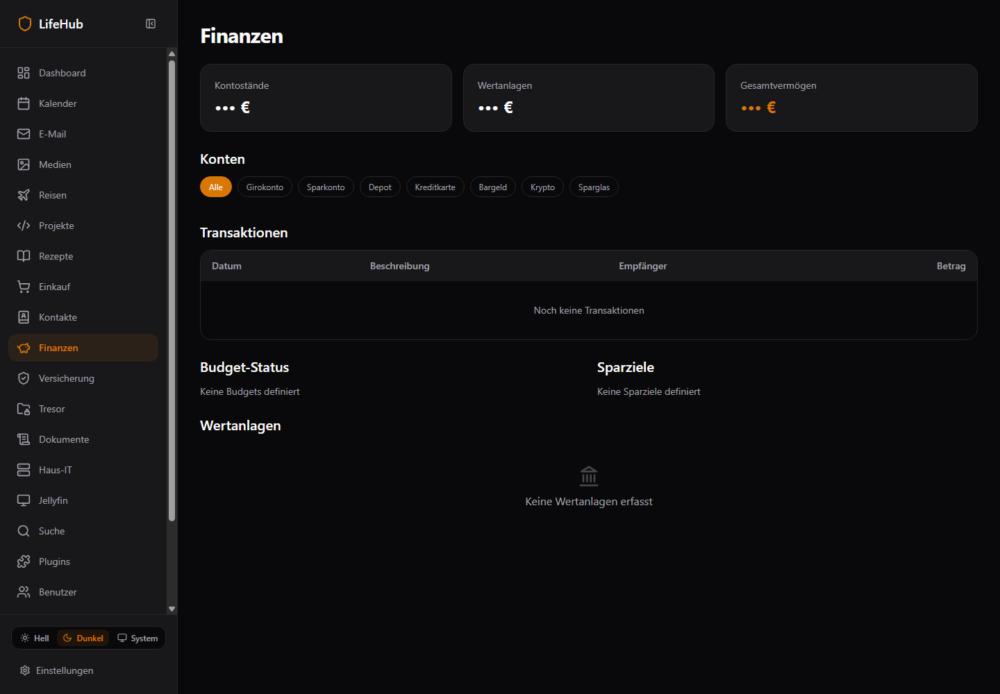
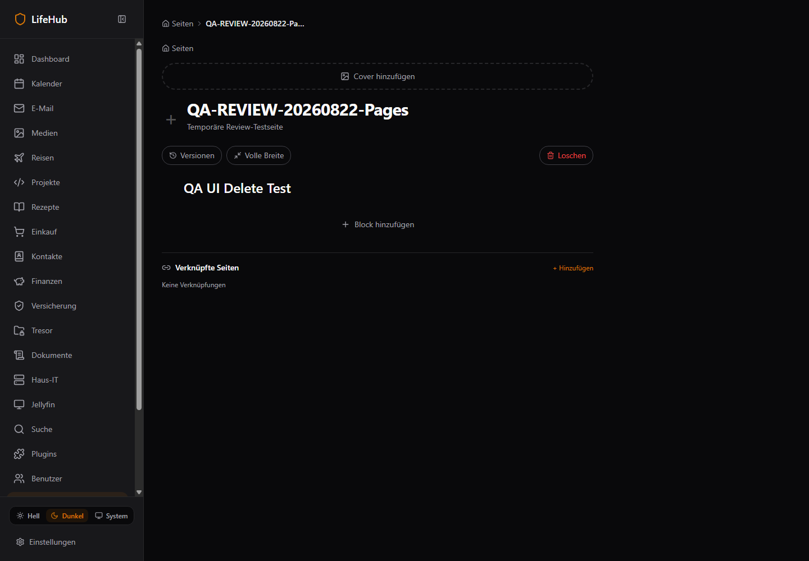
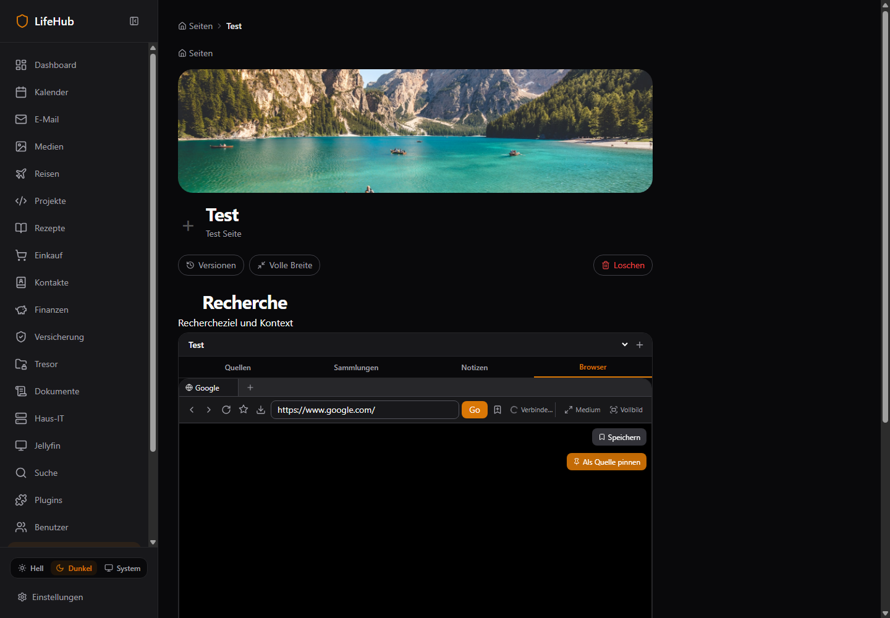

# LifeHub Code-/Funktions-/Security-/Performance-/Docker-Review 2026-08-22

> **Ergebnis:** TypeScript und Builds sind syntaktisch stabil, aber die Live- und Betriebsreife ist kritisch. 15 P0-Findings betreffen gültige Default-Admin-Zugangsdaten, fehlendes Login-Throttling, Klartext-Vault, Pages-IDOR, Browser-SSRF/Sandbox/Black-Screen, mehrere komplett ausgefallene Domains und eine nicht reproduzierbare Container-Releasekette.

| Feld | Wert |
|---|---|
| Datum | 2026-08-22 |
| Live-Ziel | http://100.124.4.24:3100 |
| Repository-SHA | 333398d2a6665becf49eaa0df6c0b40e7a8c32ae |
| Routen | 56 authentifiziert inventarisiert |
| Controls | 1.983 Source-Evidenzen; 365 Pages/Browser-Kernpfade live vertieft |
| Screenshots | 182 redigierte Captures |
| Evidence-Dateien | 224 |
| Findings | 60 Findings — 15 P0, 38 P1, 7 P2 |
| Subagenten | 8 dispatcht; Provider-401 vor Dateizugriff, daher nicht als Evidenz verwendet |

## 1. Executive Summary

**Gesamtreifegrad: 3.5/10.** Frontend-/Backend-Build, rekursive Typechecks, 87 Frontend-Tests und 2 Renderer-Token-Tests sind grün. Dieser positive Compilerstatus darf nicht mit Produktreife verwechselt werden:

- Backend-App-Test ist nur wegen `--passWithNoTests` grün; Coverage scheitert bei effektiv 0 %.
- Rekursive Domain-Tests scheitern an der Auflösung von `@lifehub/auth`.
- Live liefern sechs Finance-Endpunkte, Shopping und E-Mail 500.
- Acht direkte Deep Links verlieren durch Auth-Hydration ihr Ziel.
- Travel ruft acht falsche API-Pfade auf; der korrekte Controllerpfad liefert zusätzlich 500.
- Der Browser bleibt beim Cold Start hängen und zeigt nach Remount einen schwarzen Reconnect-Viewport.
- Der Vault speichert Passwörter/TOTP nachweislich ohne Kryptografie.
- Der Tag-Dockerjob kann aus Clean Checkout weder `.next` noch `dist` bereitstellen.

## 2. Scorecard

| Achse | Score | Kurzurteil |
|---|---|---|
| Funktionalität | 4.0/10 | ausbaufähig |
| Reliability | 3.1/10 | kritisch |
| Security | 2.1/10 | kritisch |
| Performance | 4.8/10 | ausbaufähig |
| Wartbarkeit | 4.0/10 | ausbaufähig |
| Testbarkeit | 2.8/10 | kritisch |
| Docker/Deployability | 2.4/10 | kritisch |
| Dokumentationskonsistenz | 5.2/10 | ausbaufähig |
| Gesamt | 3.5/10 | Gewichteter Review-Richtwert |

## 3. Methodik

- Source-first: 521 relevante JS/TS/TSX-Dateien, 73.317 LOC.
- 56 Routen authentifiziert und in Light/Dark geladen.
- 248 Frontend-API-Aufrufe gegen 338 Controller-Endpunkte inventarisiert.
- 28 Pages-Blocktypen live Create→GET→Delete gegen die API geprüft.
- Pages Delete zusätzlich über reale UI-Aktion und Read-back verifiziert.
- Browser Cold Start, Remount, Streamticket, Video/Track-Status und Screenshots live geprüft.
- Builds/Tests in separatem Git-Worktree; originaler dirty Arbeitsbaum unangetastet.
- Compose-Konfiguration statisch validiert; Docker Runtime auf Review-VM blockiert, weil Docker Desktop nicht läuft.
- Secrets/JWTs wurden aus allen Textartefakten redigiert.

## 4. Build-, Test- und Audit-Ergebnisse

| Gate | Status | Exit | Dauer |
|---|---|---|---|
| frontend-typecheck | PASS | 0 | 15.0s |
| frontend-lint | PASS | 0 | 11.5s |
| frontend-test | PASS | 0 | 3.04s |
| frontend-build | PASS | 0 | 32.85s |
| backend-build | PASS | 0 | 14.86s |
| backend-lint | PASS | 0 | 5.31s |
| backend-test | PASS | 0 | 0.73s |
| backend-coverage | FAIL | 1 | 1.54s |
| pages-typecheck | PASS | 0 | 2.75s |
| renderer-auth-vitest | PASS | 0 | 0.98s |
| dependency-audit-prod | FAIL | 1 | 10.77s |
| workspace-typecheck | PASS | 0 | — |
| workspace-test | FAIL | 1 | — |
| renderer-node-check | PASS | 0 | — |
| compose-dev-config | PASS | 0 | — |
| compose-prod-config | PASS | 0 | — |
| docker-runtime | BLOCKED | — | — |

**Interpretation:**

- Frontend: 87/87 Tests grün; keine Pages-, Browser- oder Komponenten-E2E-Tests.
- Backend: „PASS“ ohne Tests ist kein Qualitätssignal; Coverage-Command scheitert.
- Workspace: alle 28 Typecheck-Skripte grün; Testlauf scheitert in Contacts-/Dashboard-API-Suites an Package-Resolution.
- Lint: Exit 0, aber 76 Warnungen (38 unoptimierte Bilder, 23 Hook-Dependency-Warnungen sowie Alt-Text-Funde).
- Production Audit: **49 Vulnerabilities — 3 low, 24 moderate, 22 high**.

Vollständige Logs: `evidence/2026-08-22-lifehub/command-results.md` und `command-logs/`.

## 5. Route-/Funktions-Coverage

| Status | Anzahl |
|---|---|
| PASS_RENDER | 17 |
| PARTIAL_NETWORK_ERRORS | 20 |
| FAIL_REDIRECT_DASHBOARD | 8 |
| PARTIAL_INVALID_ID_NO_CLEAR_STATE | 6 |
| PASS_INVALID_ID_STATE | 5 |

Unerwartete Dashboard-Redirects: `/documents, /insurance, /it-inventory, /projects, /recipes/dishes/[id], /search, /travel, /vault`.

Der Deep-Link-Fehler ist ein Zustand-Hydration-Race: mehrere Pages prüfen initial `accessToken === null`, navigieren zu `/login`; die Login-Page rehydriert danach und ersetzt das Ziel mit `/dashboard`.

## 6. App-weite Funktionsprobleme

### Ausgefallene Domains

| Domain | Live-Verhalten | UI-Verhalten |
|---|---|---|
| Finance | 6/6 Kernendpunkte HTTP 500 | fälschlich „keine Daten“ |
| Shopping | `/shopping-lists` HTTP 500 | fälschlich 0 Listen + „Neue Liste“ |
| E-Mail | `/email/status` HTTP 500 | fälschlich leeres Postfach |
| Travel | Frontendpfad 404; Controllerpfad 500 | direkter Link fällt zusätzlich aufs Dashboard zurück |



### API-Verträge

- 232 statische Matches.
- 8 bestätigte Travel-Mismatches.
- 3 nicht existente `/media/music/*`-Aufrufe in einer ungenutzten Altkomponente.
- 5 Parser-Fehlmatches aus zweitem Controller derselben Datei wurden manuell korrigiert.

Rohmatrix: `evidence/2026-08-22-lifehub/api-contracts.csv`.

## 7. Pages/Notion Deep Dive

### Kernaussagen zu den Nutzerhinweisen

1. **Block löschen:** Backend und UI-Mutation funktionieren (`204`, danach GET ohne Block). Der Handle-Wrapper hat aber `opacity: 0`; der Nutzer muss ein unsichtbares Hover-Plus finden, dann ein Menü öffnen. Auf Touch/Tastatur ist das praktisch unzugänglich.
2. **Einklappbare Überschriften:** fehlen vollständig. Der vorhandene Toggle ist nur Label + Plain-Textarea.
3. **Inhaltsverzeichnis:** keinerlei Implementierung oder Heading-Index vorhanden.
4. **Everything is a database:** lediglich `database_pages(id,page_id,schema,view_config)` existiert; kein Repository, Service, Controller oder Frontend nutzt die Tabelle.
5. **Formatierung:** StarterKit kann intern einige Marks, aber live existiert kein Bold/Italic/Strike/Link-Control; Underline/Highlight/Color fehlen.
6. **Slash-Menü:** öffnet, konvertiert aber den aktuellen Textblock, statt einen neuen Block am Cursor einzufügen.
7. **Security:** Update/Delete/Reorder/Versionen prüfen nur den Owner der angegebenen Page, nicht ob die Block-ID zu dieser Page gehört.



Vollständige 38-Zeilen-Matrix: `evidence/2026-08-22-lifehub/pages-notion-matrix.csv`.

## 8. BrowserBlock/WebRTC Deep Dive

### Live-Reproduktion

1. Browser-Tab geöffnet.
2. Nach 12s: „Browser nicht erreichbar“, kein `<video>`, Endlos-Spinner.
3. Stream-API war kurz darauf gesund und stellte Ticket/Pfad bereit.
4. Erst Sources→Browser-Remount erzeugte ein Videoelement.
5. Viewport blieb schwarz; vier Video-Tracks waren `ended`; Status ging in Reconnect.



### Kritische Architekturpunkte

- initialer Streamfehler besitzt keinen Retrypfad;
- Reconnect sammelt ended MediaStream-Tracks;
- SSRF-Prüfung schützt nur die Start-URL, nicht Redirects/Subresources/neue DNS-Auflösung;
- Chromium startet weiterhin `--no-sandbox`;
- jede Session startet einen eigenen Chromium ohne Quota;
- 24h Streamticket, kein WebSocket-Origin-Check;
- Legacy `/content` liefert JSON, während der Controller HTML erwartet; Legacy POST wird ignoriert; alle Nutzer teilen Session `legacy`.

Vollständige 40-Zeilen-Matrix: `evidence/2026-08-22-lifehub/browser-matrix.csv`.

## 9. Security

### P0

- öffentlich vorbefüllte und angezeigte, live gültige Default-Admin-Zugangsdaten;
- `@Throttle` ohne registrierten `ThrottlerGuard` — effektives Login-Limit: keines;
- Vault-Passwortfeld ist `type=text`, wird als `encryptedPassword` unverändert gespeichert und von der API wieder ausgegeben; TOTP ebenso;
- Pages Block-IDOR;
- Browser Redirect-/Subresource-SSRF;
- Browser `--no-sandbox`.

### P1

- Access-TTL 24h, Tokens im LocalStorage und als Jellyfin-Image-Queryparameter;
- CORS `*` mit credentials in der Live-/Dev-Konfiguration;
- feste DB/Redis/Meili-Credentials in Compose;
- 22 hohe Dependency-Advisories.

## 10. Performance und Servereffizienz

- Vorhandener Build: 110 JS-Chunks, 3.766.597 Bytes raw; größter Chunk 513.444 Bytes.
- Next Build meldet 88,1 KB shared First Load; einzelne Routensummen bis etwa 130 KB, zusätzlich Daten/Bilder.
- Gemessene Navigationen: Median 62.0 ms, Max 136.1 ms im Tailscale-LAN nach Cache; Recipes bis 1.155.315 encoded Bytes, Pages 866.221.
- Pages-Chunk raw 137.427 Bytes; Route-Komponente 1.622 LOC.
- Media 1.704 LOC; 38 Lint-Warnungen für direkte ``.
- Jellyfin Movies erzeugte bis 862 sichtbare Interactives.
- Browser: Screenshot→Sharp→RGB→JS-I420 bei bis 15 FPS pro Session.
- Pages Reorder: N sequenzielle Updates ohne Transaction.
- Users Admin List: N+1-Rollenquery.

## 11. Wartbarkeit

| Metrik | Wert |
|---|---|
| Source-Dateien | 521 |
| LOC | 73317 |
| Testdateien | 22 |
| Test-LOC | 1802 |
| `any`-Vorkommen | 166 |
| Console-Vorkommen | 84 |
| TODO/FIXME | 18 |

Haupt-Hotspots: Media Page 1.704 LOC, Pages Page 1.622, DB Schema 1.379, Jellyfin Service 1.178 mit 59 `any`, TrackTable 1.032, Music Store 977, NowPlaying 976, Renderer 877.

## 12. Docker/NAS-Deployability

### Aktueller kritischer Releasepfad

```text
Tag → neuer CI-Checkout
    ├─ Backend-Dockerfile erwartet unversionierte apps/backend/dist + domain/shared dist
    └─ Frontend-Dockerfile erwartet unversionierte apps/frontend/.next
       → vorheriger Build-Job überträgt keine Artifacts
       → Clean-Checkout-Imagebau kann nicht reproduzierbar funktionieren
```

### Weitere Befunde

- Backend-Builder führt absichtlich keinen Build aus.
- Frontend kopiert vorgebautes `.next`; `NEXT_PUBLIC_API_BASE` ist im Manifest eingefroren.
- `start.sh` schluckt Migrationfehler und startet trotzdem.
- Frontend/Backend laufen als root; Renderer ist positiv non-root.
- Prod exponiert Backend 3007 und Chrome 3111 direkt neben Traefik.
- Keine CPU/RAM/PID-Limits; `latest` statt immutable Digest.

### Sollbild

```text
Internet/Tailscale
      │ 443
   Traefik ── security headers / rate limit / WSS origin
      ├── frontend (non-root, health, same-origin BFF)
      └── backend  (non-root, readiness nach fail-fast migration)
             ├── postgres/pgbouncer
             ├── redis/meili
             └── browser gateway ── quota/queue/egress policy
                                      └── bounded sandboxed Chromium pool
```

## 13. Positive technische Grundlagen

- 28 Workspace-Typechecks und beide Builds sind grün.
- DTO-Zod-Schemas, Nest-Layering und Guards sind breit vorhanden.
- Frontend besitzt 87 stabile Utility-/Store-Tests.
- Renderer besitzt HMAC/timing-safe Tokenprüfung, Download-Basename-Check, Bodylimit, Heartbeat, serielle Inputqueue, Maus-Release und adaptive FPS.
- Browser-Container läuft als eigener non-root User und Compose nutzt `no-new-privileges`.
- Pages besitzt Block-/Page-Versionierung, Events und flexible JSONB-Basis.
- Compose Dev/Prod ist syntaktisch gültig.

## 14. Priorisierte Umsetzung

### Welle 0 — sofort

1. Default-Admin-Zugangsdaten entfernen/rotieren; First-run Setup.
2. ThrottlerGuard aktivieren.
3. Vault bis zu echter Verschlüsselung sperren/migrieren.
4. Pages-IDOR schließen.
5. Browser egress/sandbox/quotas und Black-Screen-Retry.
6. Finance/Shopping/Email Migration-/Runtimefehler beheben.
7. Travel API-Vertrag korrigieren.
8. Release-Dockerfiles hermetisch bauen lassen.

### Welle 1 — Zuverlässigkeit

- AuthBoundary/Deep Links, Error States, Tests/Package Resolution, Migration Fail-fast, immutable Images.

### Welle 2 — Pages/Notion

- kanonische Registry, sichtbare Handles, Editor-Toolbar, Toggle Headings, TOC, Selection/Nesting.

### Welle 3 — Datenbanken und Polish

- Database Vertical Slice, Views/Properties/Formulas; danach optionale Themes/Glass.

## 15. Finding-Index

| ID | Prio | Kategorie | Titel | Status |
|---|---|---|---|---|
| BROW-001 | P0 | Browser Reliability | Browser Cold Start bleibt nach erstem Fehler im Endlos-Spinner | BOTH |
| BROW-002 | P0 | Browser WebRTC | Live Browser zeigt schwarzen Viewport und Reconnect-Schleife | BOTH |
| BROW-004 | P0 | Browser SSRF | Redirect-, DNS-Rebinding- und Subresource-SSRF bleiben offen | CODE_CONFIRMED |
| BROW-005 | P0 | Browser Sandbox | Chromium läuft weiterhin mit --no-sandbox | CODE_CONFIRMED |
| BROW-006 | P0 | Browser Capacity | Unbegrenzte Sessions starten je einen Chromium | CODE_CONFIRMED |
| DOCKER-001 | P0 | CI/CD | Tag-Dockerjob kann Frontend/Backend aus Clean Checkout nicht bauen | CODE_CONFIRMED |
| DOCKER-002 | P0 | Docker | Backend-Dockerfile überspringt alle Builds und übernimmt Host-dist | CODE_CONFIRMED |
| DOCKER-003 | P0 | Docker | Frontend-Image verlangt vorgebautes .next; API-Base ist eingefroren | CODE_CONFIRMED |
| DOCKER-004 | P0 | Migrations | Backend startet trotz fehlgeschlagener Migration | CODE_CONFIRMED |
| FUNC-002 | P0 | Travel | Travel-Frontend und Backend haben unvereinbare API-Pfade | BOTH |
| FUNC-003 | P0 | Finance | Alle sechs Finance-Kernendpunkte liefern live HTTP 500 | OBSERVED |
| PAGE-013 | P0 | Pages Security | Block-Operationen validieren Blockzugehörigkeit zur Seite nicht | CODE_CONFIRMED |
| SEC-001 | P0 | Authentication | Gültige Default-Admin-Zugangsdaten sind vorbefüllt und öffentlich angezeigt | BOTH |
| SEC-002 | P0 | Authentication | @Throttle ist wirkungslos, weil ThrottlerGuard nicht registriert ist | CODE_CONFIRMED |
| SEC-003 | P0 | Vault | Vault-Passwörter und TOTP-Secrets werden im Klartext transportiert/gespeichert/ausgegeben | CODE_CONFIRMED |
| BROW-003 | P1 | Browser Auth | Stream-Ticket gilt 24h und WebSocket prüft keinen Origin | CODE_CONFIRMED |
| BROW-007 | P1 | Browser Legacy | Legacy-Proxy-Vertrag und POST sind weiterhin kaputt | CODE_CONFIRMED |
| BROW-008 | P1 | Browser Isolation | Legacy-Renderer teilt Session „legacy“ zwischen Nutzern | CODE_CONFIRMED |
| BROW-009 | P1 | Browser Deployment | Renderer-Port 3111 ist in Dev und Prod extern exponiert | BOTH |
| BROW-010 | P1 | Browser Persistence | Tab-Synchronisierung verschluckt alle API-Fehler | CODE_CONFIRMED |
| BROW-011 | P1 | Browser Performance | Screenshot→Sharp→JS-I420 ist CPU-intensiver Video-Pfad | CODE_CONFIRMED |
| BROW-012 | P1 | Browser Testing | Browser besitzt keine UI/WebRTC/Cold-start-E2E-Suite | BOTH |
| DOCKER-005 | P1 | Container Security | Frontend und Backend laufen als root | CODE_CONFIRMED |
| DOCKER-006 | P1 | Network | Prod exponiert Backend und Chrome trotz Traefik direkt | CODE_CONFIRMED |
| DOCKER-007 | P1 | Reliability | Keine CPU/RAM/PID-Limits für Browser und Kernservices | CODE_CONFIRMED |
| FUNC-001 | P1 | Routing/Auth | Acht Deep Links verlieren ihr Ziel durch Auth-Hydration-Race | BOTH |
| FUNC-004 | P1 | Shopping | Shopping-Liste liefert live HTTP 500 | OBSERVED |
| FUNC-005 | P1 | Email | E-Mail-Status liefert live HTTP 500 | OBSERVED |
| FUNC-007 | P1 | API Contracts | Travel besitzt acht bestätigte Frontend/Controller-Mismatches | CODE_CONFIRMED |
| FUNC-009 | P1 | Testing | Backend-Testscript besteht trotz null Testdateien | BOTH |
| MAINT-001 | P1 | Maintainability | Media 1.704 LOC und Pages 1.622 LOC sind Änderungshotspots | CODE_CONFIRMED |
| MAINT-004 | P1 | Testing | Rekursiver Workspace-Test scheitert an @lifehub/auth-Auflösung | BOTH |
| PAGE-001 | P1 | Pages UX | Blocklöschen funktioniert technisch, ist aber versteckt/unzugänglich | BOTH |
| PAGE-002 | P1 | Pages UX | BlockHandle-Suchfeld filtert nichts | CODE_CONFIRMED |
| PAGE-003 | P1 | Pages Architecture | Vier widersprüchliche Blocklisten driften | CODE_CONFIRMED |
| PAGE-004 | P1 | Pages Editor | Slash-Menü konvertiert aktuellen Block statt neuen einzufügen | CODE_CONFIRMED |
| PAGE-005 | P1 | Pages Editor | Rich-Text-Formatierung ist nicht auffindbar | BOTH |
| PAGE-006 | P1 | Pages Editor | Toggle ist nur Label plus Plain-Textarea | CODE_CONFIRMED |
| PAGE-007 | P1 | Pages Editor | Einklappbare H1/H2/H3 fehlen vollständig | CODE_CONFIRMED |
| PAGE-008 | P1 | Pages Editor | Inhaltsverzeichnis aus Überschriften fehlt | CODE_CONFIRMED |
| PAGE-009 | P1 | Pages Architecture | Multi-Select, Nested Blocks und page-weites Undo fehlen | CODE_CONFIRMED |
| PAGE-010 | P1 | Pages Databases | Everything-is-a-database existiert nur als ungenutzte Tabelle | CODE_CONFIRMED |
| PAGE-011 | P1 | Pages Databases | Views, Properties, Filter, Relations, Formeln und Rollups fehlen | CODE_CONFIRMED |
| PAGE-012 | P1 | Pages Reliability | Debounced Textupdate kann beim Unmount verloren gehen | CODE_CONFIRMED |
| PAGE-014 | P1 | Pages Data Integrity | Reorder ist nicht atomar und akzeptiert beliebige Block-IDs | CODE_CONFIRMED |
| PERF-001 | P1 | Frontend Performance | Build enthält 3.77 MB JS; größter Chunk 513 KB | CODE_CONFIRMED |
| PERF-002 | P1 | Frontend Performance | Recipes lädt bis 1.16 MB encoded, Pages 866 KB | OBSERVED |
| PERF-003 | P1 | Images | Lint meldet 38 unoptimierte img-Verwendungen | BOTH |
| PERF-005 | P1 | Database | Pages-Reorder führt N Einzelupdates sequenziell aus | CODE_CONFIRMED |
| SEC-004 | P1 | Token Security | 24h Access-/LocalStorage-Tokens werden zusätzlich in Bild-URLs gelegt | CODE_CONFIRMED |
| SEC-005 | P1 | CORS | Live/Dev-Compose erlaubt CORS * mit credentials | CODE_CONFIRMED |
| SEC-006 | P1 | Secrets | Dev-Compose enthält feste DB/Redis/Meili-Secrets | CODE_CONFIRMED |
| SEC-007 | P1 | Dependencies | Produktions-Audit meldet 49 Vulnerabilities, 22 hoch | BOTH |
| DOCKER-008 | P2 | Release | Production nutzt mutable latest-Tags ohne Digest/Rollbackvertrag | CODE_CONFIRMED |
| FUNC-006 | P2 | Error Contracts | Ungültige Jellyfin-IDs führen häufig zu 500 statt 404 | OBSERVED |
| FUNC-008 | P2 | Dead Code | Alte Media-MusicLibrary ruft drei nicht existente Endpunkte | CODE_CONFIRMED |
| MAINT-002 | P2 | Maintainability | 73.317 LOC haben nur 22 Testdateien | CODE_CONFIRMED |
| MAINT-003 | P2 | Quality | Lint besteht trotz 76 Warnungen | BOTH |
| PERF-004 | P2 | DOM/A11y | Jellyfin-Seiten rendern bis 862 Interactives | OBSERVED |
| PERF-006 | P2 | Database | Userliste lädt Rollen in N+1-Schleife | CODE_CONFIRMED |

## 16. Findings im Detail

### BROW-001 · Browser Cold Start bleibt nach erstem Fehler im Endlos-Spinner

**Priorität:** P0
**Kategorie:** Browser Reliability
**Evidenzstatus:** BOTH
**Evidenz:** `Live „Browser nicht erreichbar“; API später 201; Remount nötig; BrowserBlock:145-154`

**Auswirkung:** Kernfunktion wirkt vollständig tot trotz gesundem Renderer

**Diagnose/Ursache:** startStream onError setzt nur status; Effect hängt nur an sessionId

**Empfehlung:** Bounded Retry/Backoff + manueller Retry + Startzustandsmaschine

**Akzeptanzkriterium:** Container-Coldstart heilt ohne Tabwechsel in Zielzeit

**Aufwand/Abhängigkeiten:** M · keine

---

### BROW-002 · Live Browser zeigt schwarzen Viewport und Reconnect-Schleife

**Priorität:** P0
**Kategorie:** Browser WebRTC
**Evidenzstatus:** BOTH
**Evidenz:** `browser-after-remount screenshot; 4 ended video tracks, status reconnecting`

**Auswirkung:** Browser ist nicht benutzbar

**Diagnose/Ursache:** Reconnect reused MediaStream und räumt ended tracks nicht; Handshake instabil

**Empfehlung:** Tracks/srcObject pro Reconnect sauber ersetzen; E2E-Diagnostik

**Akzeptanzkriterium:** 10-min Stream stabil, currentTime steigt, keine ended-track-Akkumulation

**Aufwand/Abhängigkeiten:** L · BROW-001

---

### BROW-004 · Redirect-, DNS-Rebinding- und Subresource-SSRF bleiben offen

**Priorität:** P0
**Kategorie:** Browser SSRF
**Evidenzstatus:** CODE_CONFIRMED
**Evidenz:** `server.js:92-108 prüft nur initial URL; page.goto folgt danach frei`

**Auswirkung:** Bösartige Seite kann Docker-/LAN-Ziele ansteuern

**Diagnose/Ursache:** Keine Request-Interception oder egress policy

**Empfehlung:** Renderer-Egress-Proxy/Firewall + jede Request-IP prüfen

**Akzeptanzkriterium:** Redirect/Subresource/DNS-rebind private Ziele geblockt

**Aufwand/Abhängigkeiten:** L · keine

---

### BROW-005 · Chromium läuft weiterhin mit --no-sandbox

**Priorität:** P0
**Kategorie:** Browser Sandbox
**Evidenzstatus:** CODE_CONFIRMED
**Evidenz:** `server.js:285-303`

**Auswirkung:** Browser-Exploit erhält direkten Containerprozess; hohes Escape-Risiko

**Diagnose/Ursache:** Sandbox explizit deaktiviert

**Empfehlung:** Chromium-Sandbox unter non-root korrekt aktivieren

**Akzeptanzkriterium:** Start ohne --no-sandbox; Security smoke test; cap_drop all

**Aufwand/Abhängigkeiten:** M · keine

---

### BROW-006 · Unbegrenzte Sessions starten je einen Chromium

**Priorität:** P0
**Kategorie:** Browser Capacity
**Evidenzstatus:** CODE_CONFIRMED
**Evidenz:** `server.js BrowserSessionManager 730-765; keine Limits`

**Auswirkung:** Ein Nutzer kann NAS-RAM/CPU erschöpfen

**Diagnose/Ursache:** Keine globale/per-user Quota, Queue oder Containerlimit

**Empfehlung:** Sessionpool, Quotas, Queue, TTL und Memory/CPU-Limits

**Akzeptanzkriterium:** 1/2/5/über-Limit Lasttest; kontrollierte 429

**Aufwand/Abhängigkeiten:** L · keine

---

### DOCKER-001 · Tag-Dockerjob kann Frontend/Backend aus Clean Checkout nicht bauen

**Priorität:** P0
**Kategorie:** CI/CD
**Evidenzstatus:** CODE_CONFIRMED
**Evidenz:** `CI Dockerjob fresh checkout; tracked .next/dist jeweils 0; Dockerfiles COPY sie`

**Auswirkung:** Release-Pipeline ist nicht reproduzierbar bzw. scheitert

**Diagnose/Ursache:** Build-Artefakte aus vorherigem Job werden weder gebaut noch übertragen

**Empfehlung:** Dockerfiles bauen selbst oder CI lädt signierte Artifacts

**Akzeptanzkriterium:** Tag aus Clean Checkout baut/pusht alle Images und Smoke-Test startet sie

**Aufwand/Abhängigkeiten:** L · keine

---

### DOCKER-002 · Backend-Dockerfile überspringt alle Builds und übernimmt Host-dist

**Priorität:** P0
**Kategorie:** Docker
**Evidenzstatus:** CODE_CONFIRMED
**Evidenz:** `backend Dockerfile:60-69; .dockerignore lässt dist absichtlich zu`

**Auswirkung:** Stale oder fehlende Binärdateien gelangen ins Image

**Diagnose/Ursache:** Builder-Stage ist nur Attrappe wegen früherem WSL-Problem

**Empfehlung:** Hermetischer Linux-Build mit Ressourcenfix; keine Host-dist-Abhängigkeit

**Akzeptanzkriterium:** docker build aus git archive erfolgreich; SHA im Binary/Image

**Aufwand/Abhängigkeiten:** L · DOCKER-001

---

### DOCKER-003 · Frontend-Image verlangt vorgebautes .next; API-Base ist eingefroren

**Priorität:** P0
**Kategorie:** Docker
**Evidenzstatus:** CODE_CONFIRMED
**Evidenz:** `frontend Dockerfile:5-10; routes-manifest destination backend:3007`

**Auswirkung:** Runtime-Env in Compose ändert Client/Rewrites nicht; stale UI-Deploys

**Diagnose/Ursache:** Prebuilt-Dockerfile und NEXT_PUBLIC Build-time-Konfiguration

**Empfehlung:** Multi-stage Next build mit explizitem ARG oder same-origin BFF

**Akzeptanzkriterium:** Image aus Clean Checkout; API-Ziel per dokumentiertem Build/Runtime-Vertrag

**Aufwand/Abhängigkeiten:** L · DOCKER-001

---

### DOCKER-004 · Backend startet trotz fehlgeschlagener Migration

**Priorität:** P0
**Kategorie:** Migrations
**Evidenzstatus:** CODE_CONFIRMED
**Evidenz:** `start.sh:29-32 „non-fatal“; Finance/Shopping live 500`

**Auswirkung:** Teilweise Schema-Stände gehen als scheinbar healthy online

**Diagnose/Ursache:** Migrationfehler wird verschluckt

**Empfehlung:** Fail-fast Migration, readiness erst nach Schema-Version

**Akzeptanzkriterium:** Kaputte Migration verhindert Start; Upgrade/Rollback getestet

**Aufwand/Abhängigkeiten:** M · keine

---

### FUNC-002 · Travel-Frontend und Backend haben unvereinbare API-Pfade

**Priorität:** P0
**Kategorie:** Travel
**Evidenzstatus:** BOTH
**Evidenz:** `Frontend /travel/trips; TravelController @Controller(trips); live 404 vs /trips 500`

**Auswirkung:** Reisen-Domain ist praktisch unbenutzbar

**Diagnose/Ursache:** API-Vertrag driftete ohne Contract-Test

**Empfehlung:** Ein kanonischer Prefix und Contract-Test; 500-Ursache beheben

**Akzeptanzkriterium:** GET/CRUD Travel liefert 2xx und Seite rendert Daten/Empty korrekt

**Aufwand/Abhängigkeiten:** M · keine

---

### FUNC-003 · Alle sechs Finance-Kernendpunkte liefern live HTTP 500

**Priorität:** P0
**Kategorie:** Finance
**Evidenzstatus:** OBSERVED
**Evidenz:** `net-worth, budgets, assets, accounts, transactions, savings-goals je 500`

**Auswirkung:** Gesamte Finanzdomain zeigt falsche Empty States

**Diagnose/Ursache:** Wahrscheinlich Deployment-/Schema-Drift; Startscript toleriert Migrationfehler

**Empfehlung:** Logs+Migration prüfen, Schema reparieren, Error UI

**Akzeptanzkriterium:** Alle Endpunkte 2xx; Migration aus leerer und bestehender DB getestet

**Aufwand/Abhängigkeiten:** L · DOCKER-004

---

### PAGE-013 · Block-Operationen validieren Blockzugehörigkeit zur Seite nicht

**Priorität:** P0
**Kategorie:** Pages Security
**Evidenzstatus:** CODE_CONFIRMED
**Evidenz:** `pages.service.ts:186-225,228-258`

**Auswirkung:** IDOR: eigener pageId plus fremde blockId kann Update/Delete/Reorder/Versionzugriff auslösen

**Diagnose/Ursache:** Nur Page-Owner wird geprüft; Block wird global per ID geladen/geändert

**Empfehlung:** Repositorymethoden nach blockId+pageId+ownerId scopen

**Akzeptanzkriterium:** Cross-owner/page Tests ergeben 404; legitime Operationen grün

**Aufwand/Abhängigkeiten:** M · keine

---

### SEC-001 · Gültige Default-Admin-Zugangsdaten sind vorbefüllt und öffentlich angezeigt

**Priorität:** P0
**Kategorie:** Authentication
**Evidenzstatus:** BOTH
**Evidenz:** `login/page.tsx:16-17,139-140; Live-Login erfolgreich`

**Auswirkung:** Jeder Netzwerkzugreifer erhält sofort Adminzugang

**Diagnose/Ursache:** Testdefaults wurden in Produktions-UI und Seed-Zustand belassen

**Empfehlung:** Keine Defaults; First-run Setup mit erzwungenem Secretwechsel

**Akzeptanzkriterium:** Frische Instanz verlangt einmaliges Admin-Setup; UI enthält keine Credentials

**Aufwand/Abhängigkeiten:** M · keine

---

### SEC-002 · @Throttle ist wirkungslos, weil ThrottlerGuard nicht registriert ist

**Priorität:** P0
**Kategorie:** Authentication
**Evidenzstatus:** CODE_CONFIRMED
**Evidenz:** `AppModule importiert ThrottlerModule, aber kein APP_GUARD/ThrottlerGuard`

**Auswirkung:** Unbegrenztes Brute Force gegen bekannten Adminaccount

**Diagnose/Ursache:** Modul konfiguriert ohne Guard; Login-Dekorator suggeriert Schutz

**Empfehlung:** Globalen ThrottlerGuard registrieren; account+IP Limits

**Akzeptanzkriterium:** 6. Fehlversuch im Fenster =>429; verteilte/accountbasierte Tests

**Aufwand/Abhängigkeiten:** S · SEC-001

---

### SEC-003 · Vault-Passwörter und TOTP-Secrets werden im Klartext transportiert/gespeichert/ausgegeben

**Priorität:** P0
**Kategorie:** Vault
**Evidenzstatus:** CODE_CONFIRMED
**Evidenz:** `vault form:379-414; service:19-27; repo:41-46; detail:258-273,318-334`

**Auswirkung:** DB/API/XSS-Kompromiss legt alle Geheimnisse offen

**Diagnose/Ursache:** Feld heißt encryptedPassword, aber es gibt keinerlei Encryption; Input type=text

**Empfehlung:** Serverseitige Envelope Encryption/KMS; DTO plaintext nur transient; Secrets nie listen

**Akzeptanzkriterium:** DB enthält nur AEAD-Ciphertext; key rotation; API redaction; Migration

**Aufwand/Abhängigkeiten:** XL · keine

---

### BROW-003 · Stream-Ticket gilt 24h und WebSocket prüft keinen Origin

**Priorität:** P1
**Kategorie:** Browser Auth
**Evidenzstatus:** CODE_CONFIRMED
**Evidenz:** `browser-renderer.service.ts:79; server.js:845-855`

**Auswirkung:** Leakbares Queryticket kann lange von fremdem Origin wiederverwendet werden

**Diagnose/Ursache:** Lange HMAC-TTL, keine Origin-/Single-use-Bindung

**Empfehlung:** 5-Min Single-use Ticket, Origin-Allowlist, Rotation

**Akzeptanzkriterium:** Replay/foreign-origin Tests werden abgelehnt

**Aufwand/Abhängigkeiten:** M · keine

---

### BROW-007 · Legacy-Proxy-Vertrag und POST sind weiterhin kaputt

**Priorität:** P1
**Kategorie:** Browser Legacy
**Evidenzstatus:** CODE_CONFIRMED
**Evidenz:** `Renderer /content => {html}; Controller behandelt response.text als HTML; method/postData ignoriert`

**Auswirkung:** Gespeicherte Legacy-Blöcke rendern JSON/GET statt Seite/Form

**Diagnose/Ursache:** Widersprüchliche alte Proxyarchitektur

**Empfehlung:** Legacy entfernen/migrieren oder Vertrag vollständig testen

**Akzeptanzkriterium:** Migration abgeschlossen; kein /proxy oder E2E GET+POST grün

**Aufwand/Abhängigkeiten:** M · keine

---

### BROW-008 · Legacy-Renderer teilt Session „legacy“ zwischen Nutzern

**Priorität:** P1
**Kategorie:** Browser Isolation
**Evidenzstatus:** CODE_CONFIRMED
**Evidenz:** `server.js:783-787,833`

**Auswirkung:** Cookies/History können Cross-user leaken

**Diagnose/Ursache:** Konstanter Profil-/Sessionname

**Empfehlung:** Legacy entfernen oder pro Owner/Request isolieren

**Akzeptanzkriterium:** Zwei Nutzer teilen keinerlei Storage/Cookies

**Aufwand/Abhängigkeiten:** M · BROW-007

---

### BROW-009 · Renderer-Port 3111 ist in Dev und Prod extern exponiert

**Priorität:** P1
**Kategorie:** Browser Deployment
**Evidenzstatus:** BOTH
**Evidenz:** `Compose ports; live /health 200`

**Auswirkung:** Traefik/Auth/Rate-Limit werden umgangen; Angriffsfläche steigt

**Diagnose/Ursache:** Browser WS wird direkt statt über kontrollierten Reverse Proxy genutzt

**Empfehlung:** Interne-only Service-Netze; WS via Origin-geschützten Proxy

**Akzeptanzkriterium:** Hostport geschlossen; Browser funktioniert via HTTPS/WSS

**Aufwand/Abhängigkeiten:** M · DOCKER-006

---

### BROW-010 · Tab-Synchronisierung verschluckt alle API-Fehler

**Priorität:** P1
**Kategorie:** Browser Persistence
**Evidenzstatus:** CODE_CONFIRMED
**Evidenz:** `BrowserBlock.tsx:205-235 .catch(()=>undefined)`

**Auswirkung:** Tabs können nach Reload fehlen/duplizieren ohne Hinweis

**Diagnose/Ursache:** Renderer und DB sind konkurrierende Sources of Truth

**Empfehlung:** Server-authoritative Mapping und sichtbarer Sync-State

**Akzeptanzkriterium:** Fehler wird angezeigt/retrybar; keine Duplikate

**Aufwand/Abhängigkeiten:** L · keine

---

### BROW-011 · Screenshot→Sharp→JS-I420 ist CPU-intensiver Video-Pfad

**Priorität:** P1
**Kategorie:** Browser Performance
**Evidenzstatus:** CODE_CONFIRMED
**Evidenz:** `server.js:180-203, captureFrame, 15 FPS`

**Auswirkung:** Mehrere Sessions skalieren schlecht auf NAS

**Diagnose/Ursache:** Jeder Frame wird voll dekodiert und per JS Pixel für Pixel konvertiert

**Empfehlung:** CDP screencast/native encoder evaluieren; FPS/Quality adaptiv messen

**Akzeptanzkriterium:** CPU je aktiver Session unter definiertem Ziel

**Aufwand/Abhängigkeiten:** XL · BROW-006

---

### BROW-012 · Browser besitzt keine UI/WebRTC/Cold-start-E2E-Suite

**Priorität:** P1
**Kategorie:** Browser Testing
**Evidenzstatus:** BOTH
**Evidenz:** `Nur 2 Auth-Tests + URL policy; Live Regression`

**Auswirkung:** Kritische Selbstheilungsinvarianten regressieren unbemerkt

**Diagnose/Ursache:** Tests decken nur Token/URL-Policy

**Empfehlung:** Containerisierte E2E-Matrix für Stream/Input/Reconnect/Isolation

**Akzeptanzkriterium:** CI reproduziert Coldstart, Black frame, tab CRUD, SSRF

**Aufwand/Abhängigkeiten:** L · keine

---

### DOCKER-005 · Frontend und Backend laufen als root

**Priorität:** P1
**Kategorie:** Container Security
**Evidenzstatus:** CODE_CONFIRMED
**Evidenz:** `Dockerfiles ohne USER; Browser ist positiv non-root`

**Auswirkung:** Container-Kompromiss hat unnötig hohe Rechte

**Diagnose/Ursache:** Runner-User nicht definiert

**Empfehlung:** UID ohne Shell, chown, read-only FS wo möglich

**Akzeptanzkriterium:** docker inspect zeigt non-root; Schreibpfade explizit

**Aufwand/Abhängigkeiten:** M · keine

---

### DOCKER-006 · Prod exponiert Backend und Chrome trotz Traefik direkt

**Priorität:** P1
**Kategorie:** Network
**Evidenzstatus:** CODE_CONFIRMED
**Evidenz:** `docker-compose.prod.yml ports 3007 und 3111`

**Auswirkung:** TLS, Rate-Limit und Security-Headers können umgangen werden

**Diagnose/Ursache:** Interne Services veröffentlichen Hostports

**Empfehlung:** Nur Traefik extern; interne Netzsegmente

**Akzeptanzkriterium:** Portscan Host zeigt nur 80/443 und explizite optionale Dienste

**Aufwand/Abhängigkeiten:** M · BROW-009

---

### DOCKER-007 · Keine CPU/RAM/PID-Limits für Browser und Kernservices

**Priorität:** P1
**Kategorie:** Reliability
**Evidenzstatus:** CODE_CONFIRMED
**Evidenz:** `Compose ohne deploy/resources/mem_limit/pids_limit`

**Auswirkung:** Browser-/Query-Spikes können gesamten NAS destabilisieren

**Diagnose/Ursache:** Ressourcenverträge fehlen

**Empfehlung:** Service-Limits, reservations, ulimits und OOM-Policy

**Akzeptanzkriterium:** 5-Session-Test bleibt innerhalb Budget; Kern-DB verfügbar

**Aufwand/Abhängigkeiten:** M · BROW-006

---

### FUNC-001 · Acht Deep Links verlieren ihr Ziel durch Auth-Hydration-Race

**Priorität:** P1
**Kategorie:** Routing/Auth
**Evidenzstatus:** BOTH
**Evidenz:** `routes.csv FAIL_REDIRECT_DASHBOARD; documents:70, insurance:88, IT:240, projects:645, search:69, travel:514, vault:60`

**Auswirkung:** Direkte URLs führen über Login zum Dashboard; Route wirkt defekt

**Diagnose/Ursache:** Effect prüft initial null accessToken vor Zustand-Rehydration

**Empfehlung:** Zentraler AuthBoundary mit hydration state und returnUrl

**Akzeptanzkriterium:** Direktaufruf jeder geschützten Route bleibt nach Rehydration erhalten

**Aufwand/Abhängigkeiten:** M · keine

---

### FUNC-004 · Shopping-Liste liefert live HTTP 500

**Priorität:** P1
**Kategorie:** Shopping
**Evidenzstatus:** OBSERVED
**Evidenz:** `/api/v1/shopping-lists 500; Shopping-Screenshot zeigt 0 Listen`

**Auswirkung:** Einkaufslisten sind nicht verlässlich nutzbar

**Diagnose/Ursache:** Backend/DB-Fehler wird als Empty State verschluckt

**Empfehlung:** Endpoint/Schema reparieren und UI-Fehlerstatus

**Akzeptanzkriterium:** GET 200; Create/Update/Delete E2E grün

**Aufwand/Abhängigkeiten:** M · DOCKER-004

---

### FUNC-005 · E-Mail-Status liefert live HTTP 500

**Priorität:** P1
**Kategorie:** Email
**Evidenzstatus:** OBSERVED
**Evidenz:** `/api/v1/email/status 500; Email-Screenshot`

**Auswirkung:** UI zeigt „Keine E-Mails“ statt Integrationsfehler

**Diagnose/Ursache:** Fehlerpfad wird nicht getrennt von leerem Postfach

**Empfehlung:** Status-Service reparieren; Connection/Error CTA

**Akzeptanzkriterium:** Connected/disconnected/error/empty eindeutig getestet

**Aufwand/Abhängigkeiten:** M · keine

---

### FUNC-007 · Travel besitzt acht bestätigte Frontend/Controller-Mismatches

**Priorität:** P1
**Kategorie:** API Contracts
**Evidenzstatus:** CODE_CONFIRMED
**Evidenz:** `api-contracts.csv CONFIRMED_MISMATCH=8`

**Auswirkung:** Jeder Travel CRUD-Aufruf trifft falsche Route

**Diagnose/Ursache:** Manuelle Stringpfade ohne OpenAPI-Client

**Empfehlung:** OpenAPI/typed Client generieren und CI-Contract-Gate

**Akzeptanzkriterium:** 0 CONFIRMED_MISMATCH; E2E pro Mutation

**Aufwand/Abhängigkeiten:** M · FUNC-002

---

### FUNC-009 · Backend-Testscript besteht trotz null Testdateien

**Priorität:** P1
**Kategorie:** Testing
**Evidenzstatus:** BOTH
**Evidenz:** `backend test PASS: No test files found; --passWithNoTests; coverage FAIL`

**Auswirkung:** CI vermittelt falsche Sicherheit; Security-/CRUD-Regressions unentdeckt

**Diagnose/Ursache:** Backend-App filtert Domain-Tests aus und toleriert Leerlauf

**Empfehlung:** No-tests als Fehler; Domain-Suites zentral aggregieren

**Akzeptanzkriterium:** Backend test führt reale Tests aus; Coverage-Schwelle enforced

**Aufwand/Abhängigkeiten:** M · keine

---

### MAINT-001 · Media 1.704 LOC und Pages 1.622 LOC sind Änderungshotspots

**Priorität:** P1
**Kategorie:** Maintainability
**Evidenzstatus:** CODE_CONFIRMED
**Evidenz:** `code-metrics.json`

**Auswirkung:** Hohe Kopplung, schwierige Tests und Merge-Konflikte

**Diagnose/Ursache:** Route, State, Dialoge, Datenzugriff und Renderer leben in Monolithdateien

**Empfehlung:** Feature-Slices/Hooks/Presenter schrittweise extrahieren

**Akzeptanzkriterium:** Kein Route-Component >500 LOC; Verhaltenstests grün

**Aufwand/Abhängigkeiten:** L · keine

---

### MAINT-004 · Rekursiver Workspace-Test scheitert an @lifehub/auth-Auflösung

**Priorität:** P1
**Kategorie:** Testing
**Evidenzstatus:** BOTH
**Evidenz:** `workspace-test.log: Contacts API suite FAIL, Dashboard API suite 0 tests; workspace typecheck PASS`

**Auswirkung:** API-Controller-Suites laufen in CI nicht; pnpm stoppt beim ersten Domainfehler

**Diagnose/Ursache:** Workspace-Package main/exports zeigt auf nicht vorhandene dist-Artefakte oder Vitest-Alias fehlt

**Empfehlung:** Test-Aliases/source exports zentral konfigurieren; Packages vor Tests reproduzierbar bauen

**Akzeptanzkriterium:** pnpm -r run test läuft aus Clean Checkout vollständig grün und führt alle Controller-Suites aus

**Aufwand/Abhängigkeiten:** M · DOCKER-002

---

### PAGE-001 · Blocklöschen funktioniert technisch, ist aber versteckt/unzugänglich

**Priorität:** P1
**Kategorie:** Pages UX
**Evidenzstatus:** BOTH
**Evidenz:** `BlockHandle wrapper opacity 0; live UI Delete 204 + Read-back absent`

**Auswirkung:** Nutzer erlebt Löschen als nicht vorhanden

**Diagnose/Ursache:** Delete liegt hinter unsichtbarem Hover-Plus-Menü

**Empfehlung:** Persistenter Handle bei Fokus/Touch, Delete-Shortcut, Undo

**Akzeptanzkriterium:** QA: Maus/Touch/Tastatur löschen + Undo; API Read-back

**Aufwand/Abhängigkeiten:** M · keine

---

### PAGE-002 · BlockHandle-Suchfeld filtert nichts

**Priorität:** P1
**Kategorie:** Pages UX
**Evidenzstatus:** CODE_CONFIRMED
**Evidenz:** `BlockHandle.tsx:87-95 ohne value/onChange; Optionen ungefiltert`

**Auswirkung:** Täuschendes Control und langsame Blockwahl

**Diagnose/Ursache:** Nur visuelles Input-Skelett implementiert

**Empfehlung:** Query-State, Filter und Keyboard-Navigation

**Akzeptanzkriterium:** Eingabe reduziert Liste und Enter wählt Treffer

**Aufwand/Abhängigkeiten:** S · keine

---

### PAGE-003 · Vier widersprüchliche Blocklisten driften

**Priorität:** P1
**Kategorie:** Pages Architecture
**Evidenzstatus:** CODE_CONFIRMED
**Evidenz:** `page.tsx union/defaults/rendering; BlockHandle 15; registry 28; DTO/entity`

**Auswirkung:** Unsupported Widgets werden angeboten oder fehlen; Änderungen vervielfacht

**Diagnose/Ursache:** Keine einzige ausführbare Registry als Source of Truth

**Empfehlung:** Registry besitzt Schema, Renderer, Default, Commands, Supportstatus

**Akzeptanzkriterium:** Jeder Typ einmal registriert; CI prüft Frontend/Backend-Parität

**Aufwand/Abhängigkeiten:** L · keine

---

### PAGE-004 · Slash-Menü konvertiert aktuellen Block statt neuen einzufügen

**Priorität:** P1
**Kategorie:** Pages Editor
**Evidenzstatus:** CODE_CONFIRMED
**Evidenz:** `page.tsx:255-257,560-565; SlashMenu.tsx:112-117`

**Auswirkung:** Bestehender Text kann unerwartet umgewandelt/verloren werden

**Diagnose/Ursache:** onSelect ist an onBlockTypeChange gekoppelt

**Empfehlung:** Insert-at-caret API und stabile Cursorposition

**Akzeptanzkriterium:** Slash erzeugt neuen Block unter Cursor ohne Inhaltsverlust

**Aufwand/Abhängigkeiten:** M · PAGE-003

---

### PAGE-005 · Rich-Text-Formatierung ist nicht auffindbar

**Priorität:** P1
**Kategorie:** Pages Editor
**Evidenzstatus:** BOTH
**Evidenz:** `StarterKit vorhanden; live formatControls=[]`

**Auswirkung:** Bold/Italic/Strike/Link nur über unbekannte Shortcuts oder gar nicht

**Diagnose/Ursache:** Keine Bubble-/Floating-Toolbar und keine Shortcut-Hilfe

**Empfehlung:** Accessible BubbleMenu mit Marks/Link/Code/Highlight

**Akzeptanzkriterium:** Selection zeigt Toolbar; Keyboard+Screenreader getestet

**Aufwand/Abhängigkeiten:** M · keine

---

### PAGE-006 · Toggle ist nur Label plus Plain-Textarea

**Priorität:** P1
**Kategorie:** Pages Editor
**Evidenzstatus:** CODE_CONFIRMED
**Evidenz:** `ToggleBlock.tsx:13-37`

**Auswirkung:** Keine echten Child-Blocks, Rich Text oder DnD

**Diagnose/Ursache:** Content-Schema speichert String statt Blockhierarchie

**Empfehlung:** Nested block model für Toggle-Children

**Akzeptanzkriterium:** Kinder beliebiger Typen anlegen/reordern/persistieren

**Aufwand/Abhängigkeiten:** L · PAGE-009

---

### PAGE-007 · Einklappbare H1/H2/H3 fehlen vollständig

**Priorität:** P1
**Kategorie:** Pages Editor
**Evidenzstatus:** CODE_CONFIRMED
**Evidenz:** `Keine toggle_heading-Komponente/Registry/DTO`

**Auswirkung:** Explizite Nutzeranforderung und Notion-Kernmuster fehlen

**Diagnose/Ursache:** Toggle und Heading sind getrennte flache Typen

**Empfehlung:** Toggle-Heading-Varianten mit Child-Blocks

**Akzeptanzkriterium:** H1/H2/H3 einklappbar, TOC/Keyboard kompatibel

**Aufwand/Abhängigkeiten:** M · PAGE-006

---

### PAGE-008 · Inhaltsverzeichnis aus Überschriften fehlt

**Priorität:** P1
**Kategorie:** Pages Editor
**Evidenzstatus:** CODE_CONFIRMED
**Evidenz:** `0 TableOfContents/TOC-Implementierungen`

**Auswirkung:** Lange Seiten sind schlecht navigierbar

**Diagnose/Ursache:** Keine stabilen Heading-Anker oder abgeleitete Outline

**Empfehlung:** Derived TOC-Block/Sidebar aus Heading-Index

**Akzeptanzkriterium:** Live aktualisiert, anklickbar, Deep-Link-fähig

**Aufwand/Abhängigkeiten:** M · PAGE-007

---

### PAGE-009 · Multi-Select, Nested Blocks und page-weites Undo fehlen

**Priorität:** P1
**Kategorie:** Pages Architecture
**Evidenzstatus:** CODE_CONFIRMED
**Evidenz:** `Keine selectedBlocks/BlockRange; flache sortOrder-Liste`

**Auswirkung:** Keine Bulk-Aktionen, Einrückung oder sichere Strukturänderungen

**Diagnose/Ursache:** Editor-State modelliert nur einzelne Blöcke

**Empfehlung:** Selection/parentBlockId/command history spezifizieren

**Akzeptanzkriterium:** Shift/Ctrl-Auswahl, Bulk move/delete/copy, Undo/Redo E2E

**Aufwand/Abhängigkeiten:** XL · PAGE-003

---

### PAGE-010 · Everything-is-a-database existiert nur als ungenutzte Tabelle

**Priorität:** P1
**Kategorie:** Pages Databases
**Evidenzstatus:** CODE_CONFIRMED
**Evidenz:** `database_pages public.ts:973-981; keine weitere Nutzung`

**Auswirkung:** Notion-Datenbankkonzept faktisch nicht vorhanden

**Diagnose/Ursache:** Schema-Stub ohne Repository/Service/API/UI

**Empfehlung:** Vollständigen Vertical Slice planen oder Stub entfernen

**Akzeptanzkriterium:** DB-Seite, Row-as-Page und Property CRUD E2E

**Aufwand/Abhängigkeiten:** XL · keine

---

### PAGE-011 · Views, Properties, Filter, Relations, Formeln und Rollups fehlen

**Priorität:** P1
**Kategorie:** Pages Databases
**Evidenzstatus:** CODE_CONFIRMED
**Evidenz:** `Keine Pages-Implementierung; pages_databases_concept.md nur Spec`

**Auswirkung:** Wesentlicher Notion-Funktionsumfang fehlt

**Diagnose/Ursache:** Kein Datenbank-View-/Property-Engine

**Empfehlung:** Phasen: typed properties → table/list → filter/sort → board/calendar → formulas

**Akzeptanzkriterium:** Jede Phase mit API-Schema, Migration und UI-E2E

**Aufwand/Abhängigkeiten:** XL · PAGE-010

---

### PAGE-012 · Debounced Textupdate kann beim Unmount verloren gehen

**Priorität:** P1
**Kategorie:** Pages Reliability
**Evidenzstatus:** CODE_CONFIRMED
**Evidenz:** `page.tsx:225-253 cleanup clearTimeout ohne flush`

**Auswirkung:** Schnelles Navigieren kann letzte 800ms Text verlieren

**Diagnose/Ursache:** Pending Update wird beim Cleanup verworfen

**Empfehlung:** Flush on blur/unmount + Save-State/Retry

**Akzeptanzkriterium:** Navigation <800ms erhält letzten Text nach Reload

**Aufwand/Abhängigkeiten:** S · keine

---

### PAGE-014 · Reorder ist nicht atomar und akzeptiert beliebige Block-IDs

**Priorität:** P1
**Kategorie:** Pages Data Integrity
**Evidenzstatus:** CODE_CONFIRMED
**Evidenz:** `pages.service.ts:220-225 Schleife ohne Transaction`

**Auswirkung:** Teilweise Sortierung/Race und fremde Blocks möglich

**Diagnose/Ursache:** Einzelupdates ohne Transaktion/Membership-Check

**Empfehlung:** Transaction + unique positions + page-scoped IDs

**Akzeptanzkriterium:** Concurrent reorder bleibt konsistent; Rollback bei Fehler

**Aufwand/Abhängigkeiten:** M · PAGE-013

---

### PERF-001 · Build enthält 3.77 MB JS; größter Chunk 513 KB

**Priorität:** P1
**Kategorie:** Frontend Performance
**Evidenzstatus:** CODE_CONFIRMED
**Evidenz:** `next-build-metrics.json: 110 JS chunks`

**Auswirkung:** Schlechter Cold Load auf Mobile/NAS, unnötige Parsekosten

**Diagnose/Ursache:** Große Libraries/Client Components werden breit gebündelt

**Empfehlung:** Bundle-Analyzer, dynamische Imports und RSC-Grenzen

**Akzeptanzkriterium:** Routebudgets: shared <150KB gzip, kein Chunk >250KB raw

**Aufwand/Abhängigkeiten:** L · keine

---

### PERF-002 · Recipes lädt bis 1.16 MB encoded, Pages 866 KB

**Priorität:** P1
**Kategorie:** Frontend Performance
**Evidenzstatus:** OBSERVED
**Evidenz:** `live-performance-summary.json`

**Auswirkung:** Kernrouten überschreiten sinnvolle Payloadbudgets

**Diagnose/Ursache:** Viele Bilder/Clientcode, fehlende Optimierung und große Editorabhängigkeiten

**Empfehlung:** Bild-/Route-Lazyload, Split Editor/Browser, Cache-Strategie

**Akzeptanzkriterium:** LCP<2.5s; definierte KB-Budgets pro Route

**Aufwand/Abhängigkeiten:** L · PERF-001

---

### PERF-003 · Lint meldet 38 unoptimierte img-Verwendungen

**Priorität:** P1
**Kategorie:** Images
**Evidenzstatus:** BOTH
**Evidenz:** `quality-summary.json; 404/blank recipe images`

**Auswirkung:** Bandbreite/LCP und Layoutqualität leiden

**Diagnose/Ursache:** Direkte img-URLs ohne Optimizer/Fallback/Dimensionvertrag

**Empfehlung:** Image-Wrapper mit Thumbnail, sizes, lazy/eager policy und Fallback

**Akzeptanzkriterium:** 0 relevante no-img warnings; LCP/bytes gemessen

**Aufwand/Abhängigkeiten:** L · UI-015

---

### PERF-005 · Pages-Reorder führt N Einzelupdates sequenziell aus

**Priorität:** P1
**Kategorie:** Database
**Evidenzstatus:** CODE_CONFIRMED
**Evidenz:** `pages.service.ts:220-225`

**Auswirkung:** Latenz und Inkonsistenz steigen linear mit Blockzahl

**Diagnose/Ursache:** Kein Batch/Transaction

**Empfehlung:** Ein statement/transaction mit Membership-Check

**Akzeptanzkriterium:** 100 Blöcke atomar innerhalb Zielzeit

**Aufwand/Abhängigkeiten:** M · PAGE-014

---

### SEC-004 · 24h Access-/LocalStorage-Tokens werden zusätzlich in Bild-URLs gelegt

**Priorität:** P1
**Kategorie:** Token Security
**Evidenzstatus:** CODE_CONFIRMED
**Evidenz:** `jwt.ts:16; auth-store.ts; music-api.ts:127/382`

**Auswirkung:** XSS, Logs, Browser-History und Referrer können Vollzugriffstoken leaken

**Diagnose/Ursache:** Bearer-Token dient zugleich als langlebiges Medien-Querytoken

**Empfehlung:** Kurze Access-TTL, HttpOnly/BFF oder separate signierte Medientickets

**Akzeptanzkriterium:** Keine JWTs in URLs; CSP/XSS-Test; Tokenrotation

**Aufwand/Abhängigkeiten:** L · keine

---

### SEC-005 · Live/Dev-Compose erlaubt CORS * mit credentials

**Priorität:** P1
**Kategorie:** CORS
**Evidenzstatus:** CODE_CONFIRMED
**Evidenz:** `main.ts:18-25; docker-compose.yml CORS_ORIGINS=*`

**Auswirkung:** Beliebige Origins dürfen Browser-API-Antworten anfragen

**Diagnose/Ursache:** Entwicklungsdefault wurde in Laufzeitkonfiguration übernommen

**Empfehlung:** Exakte Origin-Allowlist pro Umgebung

**Akzeptanzkriterium:** Fremder Origin scheitert Preflight; LifeHub-Origin grün

**Aufwand/Abhängigkeiten:** S · keine

---

### SEC-006 · Dev-Compose enthält feste DB/Redis/Meili-Secrets

**Priorität:** P1
**Kategorie:** Secrets
**Evidenzstatus:** CODE_CONFIRMED
**Evidenz:** `docker-compose.yml environment/commands`

**Auswirkung:** Repo-/Image-Leak kompromittiert alle Standardinstanzen

**Diagnose/Ursache:** Convenience-Credentials sind nicht extern konfiguriert

**Empfehlung:** Alle Secrets über .env/secret files, Rotation und Beispielwerte

**Akzeptanzkriterium:** Secret-Scan grün; frische Instanz generiert individuelle Werte

**Aufwand/Abhängigkeiten:** M · keine

---

### SEC-007 · Produktions-Audit meldet 49 Vulnerabilities, 22 hoch

**Priorität:** P1
**Kategorie:** Dependencies
**Evidenzstatus:** BOTH
**Evidenz:** `quality-summary.json; pnpm audit exit 1`

**Auswirkung:** Bekannte Schwachstellen in Next/Nest/body-parser/ws u.a.

**Diagnose/Ursache:** Abhängigkeiten wurden nicht regelmäßig aktualisiert/gated

**Empfehlung:** Patchplan, Overrides nur befristet, Audit-Gate

**Akzeptanzkriterium:** 0 high oder dokumentierte akzeptierte Ausnahme mit Datum

**Aufwand/Abhängigkeiten:** L · keine

---

### DOCKER-008 · Production nutzt mutable latest-Tags ohne Digest/Rollbackvertrag

**Priorität:** P2
**Kategorie:** Release
**Evidenzstatus:** CODE_CONFIRMED
**Evidenz:** `docker-compose.prod.yml ghcr ...:latest`

**Auswirkung:** Nicht reproduzierbare Deploys und unsicheres Rollback

**Diagnose/Ursache:** Versiontag wird nicht im Compose fixiert

**Empfehlung:** Immutable Version/Digest + dokumentiertes Rollback

**Akzeptanzkriterium:** Deployment manifestiert Build-ID/SHA und kann N-1 starten

**Aufwand/Abhängigkeiten:** S · keine

---

### FUNC-006 · Ungültige Jellyfin-IDs führen häufig zu 500 statt 404

**Priorität:** P2
**Kategorie:** Error Contracts
**Evidenzstatus:** OBSERVED
**Evidenz:** `Atlas: detail/children/playlist endpoints mit invalid ID 500`

**Auswirkung:** Schlechte Deep-Link-Resilienz und unnötige Alarmierung

**Diagnose/Ursache:** Provider-/Service-Fehler werden unnormalisiert als 500 geworfen

**Empfehlung:** Not-found auf 404 mappen, Providerfehler RFC7807

**Akzeptanzkriterium:** Invalid IDs ergeben verständlichen 404-State

**Aufwand/Abhängigkeiten:** M · keine

---

### FUNC-008 · Alte Media-MusicLibrary ruft drei nicht existente Endpunkte

**Priorität:** P2
**Kategorie:** Dead Code
**Evidenzstatus:** CODE_CONFIRMED
**Evidenz:** `MusicLibrary.tsx unimported; /media/music/* ohne Controller`

**Auswirkung:** Wartungs- und Verwechslungsrisiko

**Diagnose/Ursache:** Abgelöste Komponente blieb im Quellbaum

**Empfehlung:** Löschen oder an aktuelle Jellyfin-Musik-API anbinden

**Akzeptanzkriterium:** Kein unerreichbarer API-Clientcode

**Aufwand/Abhängigkeiten:** S · keine

---

### MAINT-002 · 73.317 LOC haben nur 22 Testdateien

**Priorität:** P2
**Kategorie:** Maintainability
**Evidenzstatus:** CODE_CONFIRMED
**Evidenz:** `code-metrics.json; Backend 0 App-Tests`

**Auswirkung:** Viele Domains sind nur manuell abgesichert

**Diagnose/Ursache:** Testpyramide/CI aggregiert Domain-Tests nicht konsequent

**Empfehlung:** Contract-/Service-/Component-/E2E-Mindestmatrix

**Akzeptanzkriterium:** Coverage je kritischer Domain mit Schwellen

**Aufwand/Abhängigkeiten:** XL · FUNC-009

---

### MAINT-003 · Lint besteht trotz 76 Warnungen

**Priorität:** P2
**Kategorie:** Quality
**Evidenzstatus:** BOTH
**Evidenz:** `quality-summary.json: 38 img, 23 hooks, Alt-Warnungen`

**Auswirkung:** Bekannte React-/A11y-/Performanceprobleme werden normalisiert

**Diagnose/Ursache:** CI nutzt Error-only Gate, keine Warning-Baseline

**Empfehlung:** Warnbudget und baseline-aware no-new-warnings

**Akzeptanzkriterium:** Neue Warnungen 0; Bestand priorisiert abgebaut

**Aufwand/Abhängigkeiten:** M · keine

---

### PERF-004 · Jellyfin-Seiten rendern bis 862 Interactives

**Priorität:** P2
**Kategorie:** DOM/A11y
**Evidenzstatus:** OBSERVED
**Evidenz:** `live-atlas-summary.json`

**Auswirkung:** Keyboard-/Screenreaderlast und DOM-Kosten steigen

**Diagnose/Ursache:** Große Listen ohne konsequente Virtualisierung/Progressive Mount

**Empfehlung:** Virtualize/limit mounted rows and controls

**Akzeptanzkriterium:** DOM/interactive Budget pro View; Tastaturnavigation stabil

**Aufwand/Abhängigkeiten:** L · keine

---

### PERF-006 · Userliste lädt Rollen in N+1-Schleife

**Priorität:** P2
**Kategorie:** Database
**Evidenzstatus:** CODE_CONFIRMED
**Evidenz:** `users.repository.ts:121-146`

**Auswirkung:** Adminliste erzeugt pro User zusätzliche Query

**Diagnose/Ursache:** findRolesByUserId pro Row

**Empfehlung:** Join/aggregate oder Batch-IN

**Akzeptanzkriterium:** Querycount bleibt konstant bei 1/100 Usern

**Aufwand/Abhängigkeiten:** S · keine

---


## 17. Grenzen und Wahrheitsstandard

- Docker-Imagebuild/Container-Smoke auf dieser VM war blockiert, weil Docker Desktop nicht lief; Compose-Config, Dockerfiles und CI wurden vollständig statisch geprüft.
- Dynamische Routen wurden mit ungültiger ID auf ihren Fehlerzustand geprüft; reale IDs wurden für Pages und Browser verwendet, nicht für jede Jellyfin-/Recipe-Detailroute.
- Von 1.983 Controls wurden 365 Pages-/Browser-Kernpfade live vertieft; übrige Controls sind source-inventoried und Route-rendered, nicht fälschlich als einzeln bestanden markiert.
- Acht Subagenten scheiterten vor Dateizugriff an Provider-401; keine ihrer Aussagen wurde verwendet.
- Produktcode, Deployment und bestehende fremde Änderungen blieben unangetastet.
