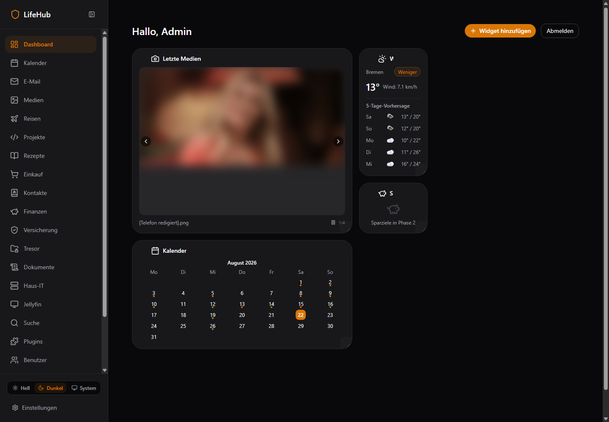
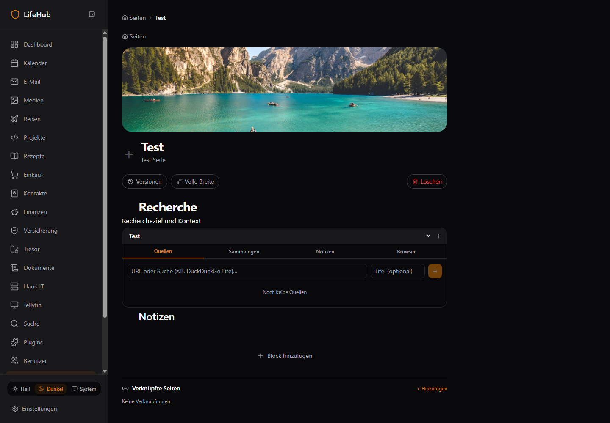
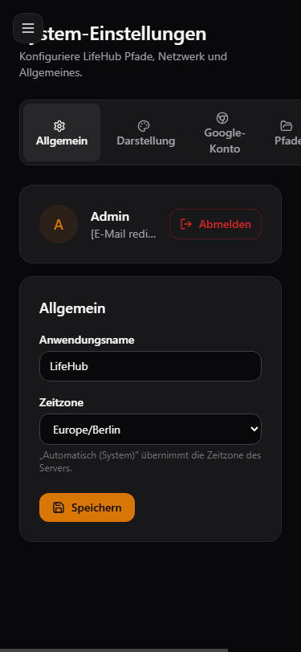
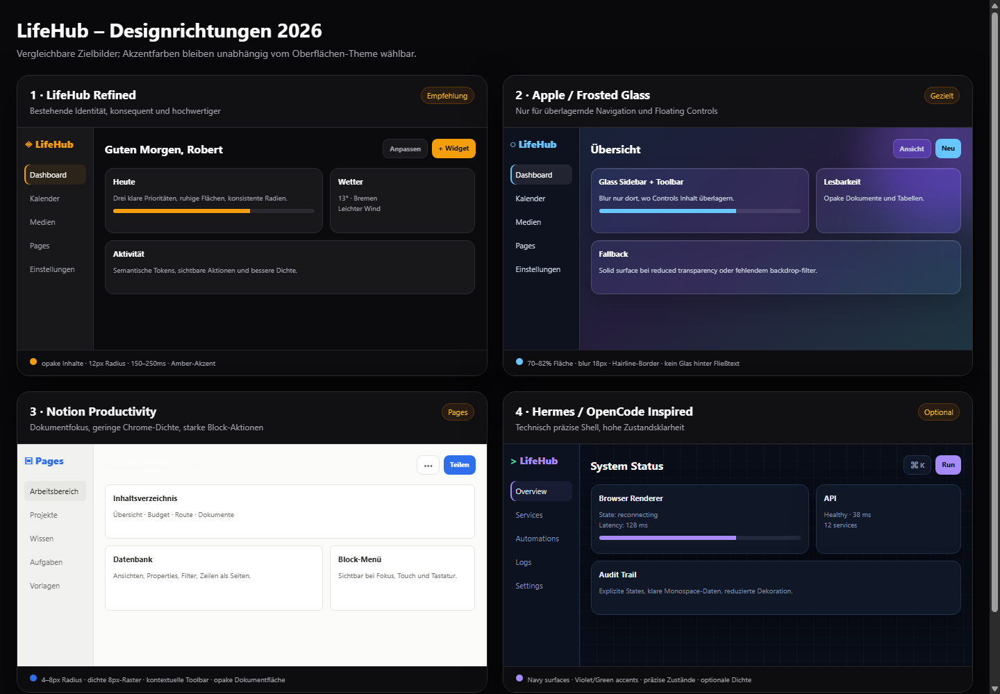

# LifeHub UI-/UX-/Design-Review 2026-08-22

> **Ergebnis:** Visuell besitzt LifeHub bereits eine erkennbare, ruhige Dark-Mode-Basis. Das System ist aber noch nicht konsistent, WCAG-AA-konform oder tatsächlich mobile-first. Empfohlen wird **LifeHub Refined** als Standard, gezieltes Frosted Glass nur für überlagernde Shell-Flächen und ein getrenntes Theme-Pack-/Akzent-System.

| Feld | Wert |
|---|---|
| Datum | 2026-08-22 |
| Live-Ziel | http://100.124.4.24:3100 |
| Repository-SHA | 333398d2a6665becf49eaa0df6c0b40e7a8c32ae |
| Routen | 56 authentifiziert inventarisiert |
| Controls | 1.983 Source-Evidenzen; 365 Pages/Browser-Kernpfade live vertieft |
| Screenshots | 182 redigierte Captures |
| Evidence-Dateien | 224 |
| Findings | 17 Findings — 0 P0, 10 P1, 7 P2 |
| Subagenten | 8 dispatcht; Provider-401 vor Dateizugriff, daher nicht als Evidenz verwendet |

## 1. Executive Summary

**Gesamtreifegrad: 4.8/10.** Die App-Shell, Icons, dunklen Flächen und der Amber-Akzent erzeugen eine erkennbare Marke. Die Domain-Seiten wurden jedoch über längere Zeit lokal gestaltet: 1799 statische Farbverwendungen stehen 2340 semantischen Tokenverwendungen gegenüber. Auf 12 Kernrouten fanden sich 4 sichtbare Controls ohne Namen, 13 unlabeled Felder und 469 Ziele unter 44 px. Primäre `brand-500`-Buttons mit weißem Text verfehlen bei **allen fünf Presets** 4,5:1.

### Direkte Antworten auf die Nutzerfragen

#### 1a · Ist das Design konsistent?

**Teilweise.** Sidebar, Grundflächen, Icon-Sprache und Dark-Mode-Atmosphäre sind konsistent. Inkonsistent sind lokale Zinc-/Amber-Farben, Radien, Formkontrollen, Error/Empty States, mobile Header, Hover-Aktionen und Theme-Presets. Besonders gravierend: Backendfehler werden auf Finance, Shopping und E-Mail als harmlose leere Daten präsentiert.

#### 1b · Wie wird es moderner und ansprechender?

1. **LifeHub Refined als Default:** semantische Surface-/Text-/Status-Tokens, klarere Raster, einheitliche Controls, bessere Dichte.
2. **Apple/Frosted Glass gezielt:** Sidebar, Topbar, Floating Toolbar, Kontextmenüs und Sheets dürfen leicht transparent sein; Dokumente, Tabellen, Karteninhalte und Browserflächen bleiben opak.
3. **Notion-Muster nur im Pages-Workspace:** ruhige Dokumentfläche, kontextuelle Block-Toolbar, Outline/TOC, Datenbank-Views.
4. **Hermes/OpenCode als optionales Theme-Pack:** technisch präzise Navy-Surfaces und Violet/Green-Akzente, nicht als neuer Default.
5. **Theme-Pack ≠ Akzent:** Surface-Theme, Dichte und Transparenz getrennt von Amber/Blue/Green/Rose/Violet/Custom speichern.

#### 1c · Ist alles ansprechend, intuitiv und erkennbar?

**Die Basissprache ist ansprechend; Interaktionen sind häufig nicht intuitiv.** Blockaktionen, Cover-Aktionen und viele Delete/Edit-Controls existieren nur bei Hover. Auf Mobile fehlen die spezifizierten Bottom-Tabs, Überschriften werden vom Hamburger überlagert und Settings-/E-Mail-Tabs laufen horizontal aus dem Viewport.

## 2. Scorecard

| Achse | Score | Kurzurteil |
|---|---|---|
| Design-Konsistenz | 5.2/10 | ausbaufähig |
| Visuelle Attraktivität | 6.4/10 | solide |
| Intuitivität | 4.8/10 | ausbaufähig |
| Accessibility | 3.2/10 | kritisch |
| Responsive/Mobile | 3.8/10 | kritisch |
| Theme-/Akzent-Reife | 4.9/10 | ausbaufähig |
| Modernität | 6.0/10 | solide |
| Feedback/States | 4.1/10 | ausbaufähig |
| Gesamt | 4.8/10 | Gewichteter Review-Richtwert |

## 3. Methodik und Coverage

- 56 Next.js-Routen aus Source inventarisiert und authentifiziert geladen.
- 56 Desktop-Dark- und 56 Desktop-Light-Captures bei 1440×1000.
- 60 zusätzliche Captures: Mobile 375×812, Tablet 768×1024 und Desktop 1920×1080 für zehn Kernrouten, jeweils Light/Dark.
- 1.983 interaktive Source-Evidenzen; Status bewusst `PARTIAL_CODE_ONLY` oder `PARTIAL_LIVE_KEY_FLOW`, nicht pauschal „bestanden“.
- A11y-/Kontrast-Audit aus computed styles plus manuelle Screenshotprüfung.
- Design-Tokens, Tailwind, Theme-Store und Settings gegen `UI_UX.md` geprüft.
- Screenshots wurden vor Speicherung für persönliche Bilder, E-Mail-/Telefon-/Geldwerte redigiert.

## 4. Was bereits gut funktioniert

- Ruhige Dark-Mode-Basis, klare Sidebar-Ikonographie und wiedererkennbare Amber-Marke.
- Zentrale semantische Tokens für `bg`, `fg`, `border` sind vorhanden und sinnvoll aufgebaut.
- Globaler `:focus-visible`-Ring ist eine gute Grundlage.
- Hell/Dunkel/System sowie fünf Presets und Custom-Hex sind im Produkt bereits auswählbar.
- Dashboard-Widgets, Pages-Cover und Jellyfin-Flächen zeigen eigenständige visuelle Identität.
- Settings besitzen klare Card-Gruppierung und verständliche Hauptüberschriften.

## 5. Visuelle Evidenz

### Dashboard — gute Basis, aber unbalanciertes Desktop-Raster

### Pages — Blockaktionen sind visuell praktisch unsichtbar

### Mobile Settings — Titelüberlagerung und horizontales Tab-Overflow

### Vier konkrete Zielrichtungen

Vollständige Tafel: `evidence/2026-08-22-lifehub/concepts/theme-directions.html`.

## 6. Konsistenz- und Tokenbefund

- **1.799 statische Farbverwendungen** umgehen die semantische Ebene. Größte Hotspots: Projects 195, Travel 161, Shopping 131, Pages 130, IT 117.
- `text-white` kommt 185-mal vor. Auf den wählbaren `brand-500`-Flächen ergibt das nur 2,28–4,23:1.
- `text-fg-subtle` erreicht 2,56:1 im Light und 4,12:1 im Dark Mode; für kleine Normaltexte ist beides unzureichend.
- Nur Amber besitzt eine explizite Light-Skala. Blue/Green/Rose/Violet bleiben in Light auf Dark-first-Tokens.
- Custom-Hex ersetzt nur 400/500/600, sodass andere Stufen auf Amber zurückfallen.

Rohdaten: `evidence/2026-08-22-lifehub/design-token-matrix.csv`.

## 7. Responsive Review

| Bereich | Desktop | Mobile 375px | Urteil |
|---|---|---|---|
| Dashboard | optisch sauber, rechts viel Leerraum | Widgets stapeln; Header/CTA gedrängt | ausbaufähig |
| Pages | übersichtlich, aber flache Affordance | Titel vom Hamburger verdeckt | kritisch |
| Settings | klare Cards | Tabs abgeschnitten, horizontale Page-Scrollbar | kritisch |
| E-Mail | 3 Spalten klar | Folder-Tabs abgeschnitten statt Sheet | kritisch |
| Rezepte | brauchbares Grid | grundsätzlich stapelbar, Bilder ohne Fallback | mittel |

Die in `UI_UX.md` geforderte Bottom-Tab-Bar ist nicht umgesetzt; Mobile nutzt nur einen Hamburger.

## 8. Accessibility

- 12 Routen, 586 sichtbare Controls.
- 4 leere accessible names, darunter Dashboard-Karussellpfeile.
- 13 Felder ohne robustes Label, u.a. Settings, Media und Music.
- 469 Controls unter 44 px; Sidebar-Links sind 40 px, zahlreiche Icon-Buttons 20–32 px.
- Pages-Zeilen sind klickbare `div`s ohne Link-/Tree-Semantik.
- Viele kontrastarme Metadaten und Hilfetexte.

Automatische Kandidaten wurden nicht blind als Fehler übernommen; Alpha-/Gradient-False-Positives sind in `a11y-audit.json` nachvollziehbar.

## 9. Glass-/Theme-Zielarchitektur

### Wo Glass sinnvoll ist

- Desktop-Sidebar und mobile Navigation-Sheets
- Sticky Topbar nach Scroll
- Floating Pages-Block-Toolbar
- Kontextmenüs, Command Palette und Dialog-/Sheet-Chrome
- Browser-Overlay-Controls über dem Stream

### Wo Glass vermieden werden soll

- Rich-Text-Dokumentfläche
- Tabellen-/Datenbank-Zellen
- lange Settings-Formulare
- Finance-/Vault-Inhalte
- Browser-Viewport selbst

### Technische Regeln

- `backdrop-filter` nur mit Solid-Fallback.
- Reduced Transparency/Reduced Motion respektieren.
- Opazität so wählen, dass Text **auf realem Hintergrund** AA erfüllt.
- Keine Scrims/Schatten hinter Bildern gegen Roberts Präferenz erzwingen; bei Bildtext zuerst Textfarbe stärken.
- Theme-Packs definieren Surfaces, Borders, Radius, Blur und Dichte; Accent-Packs definieren nur Farbtonleiter.

## 10. Findings

| ID | Prio | Kategorie | Titel | Status |
|---|---|---|---|---|
| UI-001 | P1 | Design System | 1.799 statische Farbklassen umgehen semantische Tokens | CODE_CONFIRMED |
| UI-002 | P1 | Accessibility | Weiße Schrift auf allen brand-500-Presets verfehlt WCAG AA | BOTH |
| UI-003 | P1 | Accessibility | text-fg-subtle ist für normalen Text zu kontrastarm | BOTH |
| UI-004 | P1 | Theming | Nicht-Amber-Presets verwenden im Light Mode die Dark-first-Skala | CODE_CONFIRMED |
| UI-009 | P1 | Responsive | Mobile Shell entspricht nicht der Bottom-Tab-Spezifikation | OBSERVED |
| UI-010 | P1 | Responsive | Mobile Überschriften/Tabs werden abgeschnitten und horizontal überlaufen | OBSERVED |
| UI-011 | P1 | Interaction | Zentrale Aktionen sind hover-only und auf Touch unsichtbar | BOTH |
| UI-012 | P1 | Accessibility | A11y-Audit: leere Namen, unlabeled Felder und zu kleine Ziele | BOTH |
| UI-013 | P1 | Accessibility | Pages-Einträge sind klickbare divs statt Links/Buttons | BOTH |
| UI-014 | P1 | Error UX | Backend-500 werden als leere Datenzustände verschleiert | OBSERVED |
| UI-005 | P2 | Theming | Custom-Akzent überschreibt nur 400/500/600 und mischt Rest mit Amber | CODE_CONFIRMED |
| UI-006 | P2 | Glass UI | Bestehende glass-Utility ist hardcodiert dunkel | CODE_CONFIRMED |
| UI-007 | P2 | Motion | Animationssystem respektiert reduced motion nicht global | CODE_CONFIRMED |
| UI-008 | P2 | Layout | Dashboard nutzt großen Desktopbereich nicht aus | OBSERVED |
| UI-015 | P2 | Media UX | Rezeptkarten zeigen riesige leere Bildflächen bei 404 | BOTH |
| UI-016 | P2 | Pages UX | Pages-Übersicht ist optisch flach und wenig klickbar | OBSERVED |
| UI-017 | P2 | Settings UX | Settings-Tabs besitzen keine Tab-Semantik und brechen mobil | BOTH |

## 11. Findings im Detail

### UI-001 · 1.799 statische Farbklassen umgehen semantische Tokens

**Priorität:** P1
**Kategorie:** Design System
**Evidenzstatus:** CODE_CONFIRMED
**Evidenz:** `design-token-matrix.csv; Top: projects 195, travel 161, pages 130`

**Auswirkung:** Light/Dark und Akzent-Packs driften; hohe Regressiongefahr

**Diagnose/Ursache:** Seiten wurden lokal mit Zinc/Amber/Statusfarben statt Komponenten-/Semantik-Tokens gebaut

**Empfehlung:** Semantische Surface/Text/Status-Tokens und Komponenten-Wrapper durchsetzen

**Akzeptanzkriterium:** Verbotene Klassen im dual-mode UI = 0 oder begründete Ausnahme; visuelle Regression Light/Dark

**Aufwand/Abhängigkeiten:** L · UI-004

---

### UI-002 · Weiße Schrift auf allen brand-500-Presets verfehlt WCAG AA

**Priorität:** P1
**Kategorie:** Accessibility
**Evidenzstatus:** BOTH
**Evidenz:** `Berechnet: Amber 3.19:1, Blau 3.68, Grün 2.28, Rosé 3.67, Violett 4.23; a11y-audit.json`

**Auswirkung:** Primäre CTAs sind für viele Nutzer nicht ausreichend lesbar

**Diagnose/Ursache:** Ein universelles text-white wird auf zu hellen, frei wählbaren Akzenten verwendet

**Empfehlung:** Kontrastadaptiven Button-Text oder dunklere CTA-Stufe verwenden

**Akzeptanzkriterium:** Jedes Preset und Custom-Hex erreicht 4.5:1; automatisierter Kontrasttest

**Aufwand/Abhängigkeiten:** M · keine

---

### UI-003 · text-fg-subtle ist für normalen Text zu kontrastarm

**Priorität:** P1
**Kategorie:** Accessibility
**Evidenzstatus:** BOTH
**Evidenz:** `Light 2.56:1, Dark 4.12:1; live Hilfetexte/Badges`

**Auswirkung:** Hilfen, Zähler und Metadaten sind schwer lesbar

**Diagnose/Ursache:** Subtle-Token wird für normalen 10–12px Text statt rein dekorative Inhalte verwendet

**Empfehlung:** Token heller/dunkler abstufen und Nutzung auf große/dekorative Inhalte begrenzen

**Akzeptanzkriterium:** Normaltext >=4.5:1 in Light und Dark

**Aufwand/Abhängigkeiten:** S · keine

---

### UI-004 · Nicht-Amber-Presets verwenden im Light Mode die Dark-first-Skala

**Priorität:** P1
**Kategorie:** Theming
**Evidenzstatus:** CODE_CONFIRMED
**Evidenz:** `globals.css:43-108 vs. :root:not([data-accent]):not(.dark):110-123`

**Auswirkung:** Blue/Green/Rose/Violet verhalten sich im Light Theme farblich inkonsistent

**Diagnose/Ursache:** data-accent-Selektoren unterscheiden Light und Dark nicht

**Empfehlung:** Je Preset separate Light-/Dark-Tokens definieren

**Akzeptanzkriterium:** Alle sechs Akzente bestehen Snapshot+Kontrasttests in beiden Modi

**Aufwand/Abhängigkeiten:** M · keine

---

### UI-009 · Mobile Shell entspricht nicht der Bottom-Tab-Spezifikation

**Priorität:** P1
**Kategorie:** Responsive
**Evidenzstatus:** OBSERVED
**Evidenz:** `mobile/dashboard__375x812__dark.png; UI_UX.md:258-263`

**Auswirkung:** Mobile Navigation ist versteckt; Kernbereiche benötigen Zusatzschritt

**Diagnose/Ursache:** Desktop-Sidebar wird nur zum Hamburger statt zu fünf Bottom-Tabs

**Empfehlung:** Mobile Bottom-Bar + Mehr-Sheet implementieren

**Akzeptanzkriterium:** 375px: fünf Kernziele sichtbar, keine Überlagerung

**Aufwand/Abhängigkeiten:** M · keine

---

### UI-010 · Mobile Überschriften/Tabs werden abgeschnitten und horizontal überlaufen

**Priorität:** P1
**Kategorie:** Responsive
**Evidenzstatus:** OBSERVED
**Evidenz:** `mobile/pages, mobile/settings, mobile/email Screenshots`

**Auswirkung:** Seitenname beginnt als „iten“, Settings als „stem…“; Tabs/Pfade abgeschnitten

**Diagnose/Ursache:** Hamburger liegt absolut über Content; Desktop-Tabreihen bleiben ungebrochen

**Empfehlung:** Mobile Header-Inset, scrollbare/gestapelte Tabs und Sheet-Navigation

**Akzeptanzkriterium:** 320/375px ohne Textüberlagerung oder horizontale Page-Scrollbar

**Aufwand/Abhängigkeiten:** M · UI-009

---

### UI-011 · Zentrale Aktionen sind hover-only und auf Touch unsichtbar

**Priorität:** P1
**Kategorie:** Interaction
**Evidenzstatus:** BOTH
**Evidenz:** `BlockHandle.tsx:74; PageHeader.tsx:128; mehrere Blockkomponenten`

**Auswirkung:** Delete/Edit/Remove sind auf Touch und Tastatur kaum erreichbar

**Diagnose/Ursache:** opacity-0 group-hover wird als primäres Aktionsmodell genutzt

**Empfehlung:** focus-within, sichtbares Touch-Menü und persistente Handles ergänzen

**Akzeptanzkriterium:** Alle Aktionen per Touch, Tastatur und Screenreader erreichbar

**Aufwand/Abhängigkeiten:** M · keine

---

### UI-012 · A11y-Audit: leere Namen, unlabeled Felder und zu kleine Ziele

**Priorität:** P1
**Kategorie:** Accessibility
**Evidenzstatus:** BOTH
**Evidenz:** `12 Routen: 586 Controls, 4 leere Namen, 13 unlabeled Felder, 469 Ziele <44px`

**Auswirkung:** Screenreader-/Touchbedienung deutlich eingeschränkt

**Diagnose/Ursache:** Icon-Buttons und Inputs verlassen sich auf Optik/Placeholder; 24–40px Targets

**Empfehlung:** Accessible Names/Labels und 44px Touchflächen als Komponentenvertrag

**Akzeptanzkriterium:** 0 leere Namen/unlabeled Felder; kritische Touchziele >=44px

**Aufwand/Abhängigkeiten:** L · keine

---

### UI-013 · Pages-Einträge sind klickbare divs statt Links/Buttons

**Priorität:** P1
**Kategorie:** Accessibility
**Evidenzstatus:** BOTH
**Evidenz:** `page.tsx:352-385; live-pages.json listet Einträge nicht als Controls`

**Auswirkung:** Keine Tab-Navigation, keine Linksemantik, schlechter Deep-Link

**Diagnose/Ursache:** onClick/cursor-pointer liegt auf div ohne role/tabIndex

**Empfehlung:** Semantische Links/treeitems verwenden

**Akzeptanzkriterium:** Alle Seiten per Tab/Enter erreichbar und URL kopierbar

**Aufwand/Abhängigkeiten:** S · keine

---

### UI-014 · Backend-500 werden als leere Datenzustände verschleiert

**Priorität:** P1
**Kategorie:** Error UX
**Evidenzstatus:** OBSERVED
**Evidenz:** `Finance/Shopping/Email Screenshots + live 500s`

**Auswirkung:** Nutzer glaubt, er habe keine Daten und kann falsche Aktionen ausführen

**Diagnose/Ursache:** Queries behandeln error wie leere Arrays oder ignorieren Statusfehler

**Empfehlung:** Explizite Error Boundary, Ursache, Retry und Offline-Status

**Akzeptanzkriterium:** 500 zeigt Fehler+Retry, niemals Empty State

**Aufwand/Abhängigkeiten:** M · FUNC-003,FUNC-004,FUNC-005

---

### UI-005 · Custom-Akzent überschreibt nur 400/500/600 und mischt Rest mit Amber

**Priorität:** P2
**Kategorie:** Theming
**Evidenzstatus:** CODE_CONFIRMED
**Evidenz:** `theme-store.ts:35-49`

**Auswirkung:** Custom-Theme wirkt in Komponenten mit 50–300/700–900 zweifarbig

**Diagnose/Ursache:** Aus Custom-Hex wird keine vollständige Tonleiter erzeugt

**Empfehlung:** Vollständige OKLCH-Tonleiter generieren

**Akzeptanzkriterium:** 50–900 folgen Custom-Hue; Kontrasttests bestanden

**Aufwand/Abhängigkeiten:** M · UI-002

---

### UI-006 · Bestehende glass-Utility ist hardcodiert dunkel

**Priorität:** P2
**Kategorie:** Glass UI
**Evidenzstatus:** CODE_CONFIRMED
**Evidenz:** `globals.css:153-157`

**Auswirkung:** Glass-Flächen funktionieren im Light Theme nicht konsistent

**Diagnose/Ursache:** rgba(24,24,27,.7) und weiße Border sind nicht theme-aware

**Empfehlung:** Glass-Surface über semantische RGB/Alpha-Tokens plus Fallback definieren

**Akzeptanzkriterium:** Light/Dark/Reduced Transparency visuell und per Kontrast geprüft

**Aufwand/Abhängigkeiten:** S · keine

---

### UI-007 · Animationssystem respektiert reduced motion nicht global

**Priorität:** P2
**Kategorie:** Motion
**Evidenzstatus:** CODE_CONFIRMED
**Evidenz:** `globals.css:165-169; keine prefers-reduced-motion-Regel`

**Auswirkung:** Vestibuläre Barriere und Verstoß gegen UI_UX.md

**Diagnose/Ursache:** Animationen sind unbedingte Utilities

**Empfehlung:** Globale reduced-motion-Variante und component-level opt-out

**Akzeptanzkriterium:** Bei prefers-reduced-motion keine nichtessenzielle Bewegung

**Aufwand/Abhängigkeiten:** S · keine

---

### UI-008 · Dashboard nutzt großen Desktopbereich nicht aus

**Priorität:** P2
**Kategorie:** Layout
**Evidenzstatus:** OBSERVED
**Evidenz:** `dashboard__1440x1000__dark__default.png`

**Auswirkung:** Schwache Hierarchie, viel tote Fläche, Widgets wirken zufällig

**Diagnose/Ursache:** Grid packt große Medien-/Kalenderkarten links und schmale Widgets in eine Mini-Spalte

**Empfehlung:** Responsive 12-Spalten-Grid, klare Widget-Größen und Ausrichtung

**Akzeptanzkriterium:** 1440/1920px ohne unbegründete Leerräume; Resize-Grenzen stabil

**Aufwand/Abhängigkeiten:** M · keine

---

### UI-015 · Rezeptkarten zeigen riesige leere Bildflächen bei 404

**Priorität:** P2
**Kategorie:** Media UX
**Evidenzstatus:** BOTH
**Evidenz:** `recipes screenshot; recipe pages always request /recipes/image/:id`

**Auswirkung:** Unprofessionelle Karten, verschwendete Fläche, schlechter Scan

**Diagnose/Ursache:** Image wird immer gerendert; Listen-/Detailansicht ohne onError-Fallback

**Empfehlung:** Thumbnail-Verfügbarkeit im Modell + kompakter Fallback

**Akzeptanzkriterium:** 404 zeigt definierte Placeholder-Karte ohne Layoutloch

**Aufwand/Abhängigkeiten:** S · keine

---

### UI-016 · Pages-Übersicht ist optisch flach und wenig klickbar

**Priorität:** P2
**Kategorie:** Pages UX
**Evidenzstatus:** OBSERVED
**Evidenz:** `pages-overview screenshot`

**Auswirkung:** Hierarchie und Ziel der Zeilen sind schwer erkennbar; viel tote Fläche

**Diagnose/Ursache:** Eine große Card um alle Rows, kaum Hover/Chevron/Metadaten

**Empfehlung:** Tree/List mit klaren Row-Zuständen, Sortierung und Suchfeld

**Akzeptanzkriterium:** Klickziel, Parent/Child und Aktionen sind sofort erkennbar

**Aufwand/Abhängigkeiten:** M · keine

---

### UI-017 · Settings-Tabs besitzen keine Tab-Semantik und brechen mobil

**Priorität:** P2
**Kategorie:** Settings UX
**Evidenzstatus:** BOTH
**Evidenz:** `settings/page.tsx:55-70; mobile/settings screenshot`

**Auswirkung:** Screenreader- und Mobile-Navigation unklar

**Diagnose/Ursache:** Buttons ohne tablist/tab/aria-selected; feste horizontale Reihe

**Empfehlung:** Radix Tabs oder vollständige ARIA-Tabs plus mobile Scroll/Select

**Akzeptanzkriterium:** Keyboard-Pfeile, aria-selected und 320px-Reflow funktionieren

**Aufwand/Abhängigkeiten:** S · keine

---

## 12. Empfohlene Reihenfolge

1. **P0/P1 Accessibility und Fehlerwahrheit:** CTA-Kontrast, mobile Clipping, sichtbare Fehler statt Fake-Empty, Blockaktionen.
2. **Semantische Token-Migration:** Komponenten-Wrapper, Preset-Light-Skalen, vollständige Custom-Tonleiter.
3. **Responsive Shell:** Bottom Tabs, Header-Inset, mobile Tabs/Sheets.
4. **LifeHub Refined:** Raster, Dichte, einheitliche Buttons/Cards/Forms.
5. **Optionale Themes:** Frosted Glass und Hermes/OpenCode erst nach WCAG-/Shell-Stabilität.

## 13. Grenzen

Die acht geplanten Subreviewer konnten wegen Provider-401 keine Datei lesen. Daher wurden keine unverifizierten Subagentenbefunde übernommen. Cross-Check erfolgte stattdessen dreifach: Live-DOM/Screenshots ↔ aktueller Source ↔ Master-Specs. Produktcode wurde nicht verändert.
